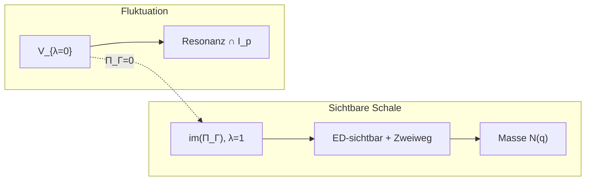

# Masse-Konstitution zwischen EABC-Objekten

**Prinzip (#Energiedoku / arXiv):** *Masse konstituiert sich nur zwischen EABC-Objekten, die elektrodynamisch sichtbar werden und die Existenz einer Zweiweglichtgeschwindigkeit erlauben.*

Verknüpfung: `PAPER_Q_STRUCTURE.md` (Π\_Γ-Spektrum), `PAPER_HURWITZ_RESONANZ.md` (Resonanz vs. Fluktuation), `Freie_Parameter_Standardmodell_Artikel.tex` (arithmetische Trägheit), `Jitter_Zeit_EABC_Artikel.tex` (aktive Folge, Schwung), `Rindler.tex` (Einweg/Zweiweg).

---

## 1. EABC-Objekte und „zwischen“

**Objekte.** Ein *EABC-Objekt* ist ein Element der Klein-Vierer-Gruppe \(V_4=\{E,A,B,C\}\), eingebettet in die Hurwitz-Quaternionenalgebra \(H\) via \(E\mapsto 1\), \(A\mapsto i\), \(B\mapsto j\), \(C\mapsto k\) (`Global Lokal.py`, `Jitter_Zeit_EABC_Artikel.tex`). Diskret: \(\mathrm{label}(n)\in\{E,A,B,C\}\) für \(n\bmod 12\in\{1,5,7,11\}\).

**Zwischen (relational).** Masse ist keine Eigenschaft isolierter Punkte \(q\in H\), sondern einer *Zwischenstruktur*:

| Ebene | Formalisierung | Code/Referenz |
|-------|----------------|---------------|
| **Kante** | Geordnetes Paar \((X,Y)\in\{E,A,B,C\}^2\), \(X\neq Y\) optional; Übergangsmatrix der aktiven Folge | `Jitter Zeit.py`, `transition_matrix` |
| **Schwung** | \(u_{k}=\overline{q_k}\,q_{k+1}\in H\) zwischen aufeinanderfolgenden *aktiven* Ereignissen | `active_transition_schwung` |
| **Viererstruktur** | Neutraler Vierling \(s\in X_E\subset V_4^4\) mit \(\prod s_i=E\); Paarflips \(F_{ij,g}\) | `Global Lokal.py` |
| **Bindungsdipol** | Orientierte Hülle \(D_{BC}=B+C\), Bindung \(B\circ C=+A\), \(C\circ B=-A\) | `Bahndrehimpuls.tex`, `Bamberger_Modell_III_arxiv.tex` |

**Axiom (relational).** Eine Massengröße \(m\) ist eine Funktion auf einem *Zwischenraum*
\[
\mathcal{Z} \;=\; \bigl(\{E,A,B,C\}^2 \times H\bigr) \;\cup\; X_E \;\cup\; \{\text{aktive Kanten der Zeitwürfel-Folge}\},
\]
nicht auf \(\{E,A,B,C\}\) allein.

---

## 2. Elektrodynamisch sichtbar

**Sichtbare Restklassen-Ebene.** Die kommutative \(V_4\)-Algebra der mod-12-Klassen ist die *sichtbare* Halbstruktur; die quaternionische Hebung trägt Spinor-Orientierung (`Bahndrehimpuls.tex`).

**Operatives Kriterium (Π\_Γ-Schale).** Mit \(\Pi_\Gamma=\frac14(I+\Gamma+\Gamma^2+\Gamma^3)\) auf \(\mathbb{Q}^4\cong H\) (`Rundweg.py`):

- **Sichtbarer (glatter) Anteil:** \(q_{\mathrm{sicht}}=\Pi_\Gamma(q)\in\mathrm{im}(\Pi_\Gamma)=\ker(\Pi_\Gamma-I)\), Eigenwert \(\lambda=1\), Dimension 3.
- **Unsichtbare Fluktuation:** \(q_{\mathrm{fluk}}=(I-\Pi_\Gamma)q\in V_{\lambda=0}=\mathrm{span}(A-C)\).

**Elektrodynamisch** heißt hier: der sichtbare Anteil koppelt an den *Bindungskanal* \(A\) (orientierte elektromagnetische Bindung Kern–Hülle, \(\pm A\leftrightarrow\eta\in\mathbb{Z}/24\mathbb{Z}\)) und ist im Spektralprotokoll messbar — nicht-null Leistung \(P_A(\Omega)\) oder \(P_{\mathrm{ges}}(\Omega)\) in `quaternionic_spectrum` (`Jitter_Zeit_EABC_Artikel.tex`).

**Definition.**
\[
\mathrm{ED\text{-}sichtbar}(q)
\;\Leftrightarrow\;
\Pi_\Gamma(q)\neq 0
\;\wedge\;
\exists\,\Omega:\; P_{\mathrm{ges}}(\Omega)>0 \text{ auf der aktiven } q\text{-Folge}.
\]
Für reine \(V_{\lambda=0}\)-Vektoren (z.\,B. \(q_{\mathrm{asym}}=i-k\)) gilt \(\Pi_\Gamma(q)=0\): *nicht* elektrodynamisch sichtbar im Schalen-Sinn — sie sind Fluktuationsträger (`PAPER_Q_STRUCTURE.md`).

---

## 3. Zweiweglichtgeschwindigkeit

**Struktur (Rindler).** Geschlossener Zyklus \(\oint_\gamma ds=\int_{\gamma_H}ds+\int_{\gamma_Q}ds\); *Zweiweg-*\(c\) ist die messbare Rundreise-Geschwindigkeit, *Einweg-*\(c\) synchronisationsabhängig (`Rindler.tex`, Abschnitt Einweg/Zweiweg).

**Diskretes EABC-Analogon.**

1. **Bidirektionale Kopplung:** Hamiltonian in `Global Lokal.py`: \(H=-t(T+T^{-1})-\lambda F_{\mathrm{sum}}+V\) — Informationsfluss in beide Shift-Richtungen.
2. **Reversibler Schwung:** Zu \(u=\overline{q_k}q_{k+1}\) existiert \(u^{-1}=\overline{q_{k+1}}q_k\) (für Einheitsquaternionen auf der aktiven Folge).
3. **Holonomer Rundweg:** \(\Gamma=R\cdot K\) mit \(\Pi_\Gamma\) als Mittelung über \(L=4\) — geschlossene Schalenholonomie.

**Definition.**
\[
\mathrm{Zweiweg}(X,Y)
\;\Leftrightarrow\;
\exists\,\text{Pfad } X\!\to\!\cdots\!\to Y \text{ und } Y\!\to\!\cdots\!\to X
\]
in der aktiven Übergangsgraphik *und* \(T+T^{-1}\) wirkt auf den von \((X,Y)\) getragenen Zustandsraum.

**Effektive Lichtgeschwindigkeit (Skizze).** Auf einer aktiven Kante mit \(\Delta t_{\mathrm{active}}>0\):
\[
c_{\mathrm{Zweiweg}}(k):=\frac{\|u_k\|}{\Delta t_{\mathrm{active},k}}
\]
ist nur definiert, wenn der Rückweg in der Simulation oder im Modell denselben \(\|u_k\|\)-Betrag trägt (Zeitsymmetrie oder \(T\leftrightarrow T^{-1}\)).

---

## 4. Masse vs. Fluktuation (\(V_{\lambda=0}\))

| Phänomen | Ort im Π\_Γ-Spektrum | Hurwitz | Physikalische Lesart |
|----------|----------------------|---------|----------------------|
| **Fluktuation** | \(V_{\lambda=0}\), Basis \(A-C\) | Resonanz: \(0\neq q\in V_{\lambda=0}\cap I_p\) (`PAPER_HURWITZ_RESONANZ.md`) | Antisymmetrischer Schalen-Träger, *keine* Trägheit |
| **Masse** | \(\mathrm{im}(\Pi_\Gamma)\), \(\lambda=1\) | \(N(q)\) auf Hurwitz-Gitter, Eigenwerte Dirac–Laplace (`Freie_Parameter_Standardmodell_Artikel.tex`) | Arithmetische Trägheit / Knotendichte |

**Konstitutionsaxiom (Masse).** Eine Massenkonfiguration liegt vor, wenn auf einem Zwischenobjekt \(z\in\mathcal{Z}\):

1. die beteiligten EABC-Labels elektrodynamisch sichtbar sind (\(\mathrm{ED\text{-}sichtbar}\) auf dem zugehörigen Aggregat \(q(z)\)),
2. \(\mathrm{Zweiweg}\) für die tragenden Kanten gilt,
3. der Π\_Γ-glättete Anteil \(q_{\mathrm{sicht}}=\Pi_\Gamma(q(z))\) nichttrivial ist und eine Hurwitz-Norm \(N(q_{\mathrm{sicht}})\ge 1\) trägt.

**Beispiel.** \(q_{\mathrm{lokal}}=(5,2,0,1)\): \(\Pi_\Gamma\) liefert glatten Anteil \((5,1,0,1)\) — *Kandidat* für Masse-Konstitution. \(q_{\mathrm{asym}}=i-k\): \(\Pi_\Gamma(q)=0\) — reine Fluktuation; Hurwitz-Resonanz in \(I_5,I_7\) scheitert numerisch (`run_hurwitz_resonanz.sh`).

**Quadratischer Schwung (Kapitel 8):** Resonanz über \(u=\bar{q}q'\) statt linearem \(q\in I_p\). LaTeX: `kapitel_5_8_schalen_kollaps.tex`; Numerik: `./run_schwung_resonanz.sh` (`rundweg_schwung_resonanz.sage`). Fluktuation bleibt in \(V_{\lambda=0}\); Schwung-Resonanz ist orthogonal zur Masse-Konstitution in \(\mathrm{im}(\Pi_\Gamma)\).

---

## 5. Verknüpfung Hurwitz / Π\_Γ



- **Resonanz** (Pfad B): Schnitt \(V_{\lambda=0}\cap I_p\) — *arithmetische* Sichtbarkeit auf Primideal-Sphäre, **ohne** glatten Π\_Γ-Anteil.
- **Masse:** bevorzugt \(\mathrm{im}(\Pi_\Gamma)\cap\{q\in H:\mathrm{ED\text{-}sichtbar}(q)\wedge\mathrm{Zweiweg}\}\); Resonanzpunkte in \(V_{\lambda=0}\) sind **orthogonal** zur Masse-Konstitution, können aber Fluktuation in Schalen koppeln.

**Verschärfung der Hurwitz-Analyse:** Scan nicht nur \(q\in V_{\lambda=0}\), sondern \(\Pi_\Gamma(q_{\mathrm{agg}})\) für H32-/Zeitwürfel-Aggregate; teste \(N(\Pi_\Gamma q)\) und \(p\mid N(\cdot)\) getrennt von \(V_{\lambda=0}\cap I_p\).

---

## 6. Operativer Test (`run_masse_test.sh`)

Skript: `masse_konstitution_test.sage` (lädt `rundweg_hurwitz_resonanz.sage` für Π\_Γ, Ideale \(I_5,I_7\)).

Für \(M=113160\): H32-Slot-Aggregat und Zeitwürfel-Zähler (CSV `bamberger_zeitwuerfel_active_*.csv`) → \(q_{\mathrm{sicht}}=\Pi_\Gamma q\), \(q_{\mathrm{fluk}}=q-q_{\mathrm{sicht}}\); Kriterium Masse-Kandidat: \(q_{\mathrm{sicht}}\neq 0\), \(N(q_{\mathrm{sicht}})\ge 1\); optional Zweiweg aus bidirektionalen EABC-Pfaden in `active_transitions`.

**Beispiel-Output** (`./run_masse_test.sh`, SageMath):

```
=== MASSE-KONSTITUTION-TEST (Π_Γ, Hurwitz I_5/I_7) ===
H32: 17 belegte Slots, EABC-Zähler {'E': 4, 'A': 5, 'B': 3, 'C': 5}
  q_sicht = (4, 5, 3, 5),  N(q_sicht) = 75  →  Masse-Kandidat: JA
Zeitwürfel: 662 aktiv, Zweiweg-Flag: True
  aktiv: q_sicht = (164, 333/2, 165, 333/2), N = 219131/2  →  JA; q_fluk = (0, 1/2, 0, -1/2), I_5/I_7: nein
  phasengekoppelt: q_sicht = (130, 133, 132, 133), N = 69702  →  JA; q_fluk = 0
ZUSAMMENFASSUNG: 3 Masse-Kandidaten; Fluktuation q_fluk in I_5 ∪ I_7: nein
```

Weitere Schritte: Resonanz-Scan (`run_hurwitz_resonanz.sh`) vs. glatte Normen; Einheiten-Scan auf \(q_{\mathrm{sicht}}\) (nicht \(q_{\mathrm{asym}}\)).

LaTeX-Axiom: `paper_masse_axiom.tex`. Verweis in `PAPER_HURWITZ_RESONANZ.md` (Abschnitt Masse vs. Resonanz).
