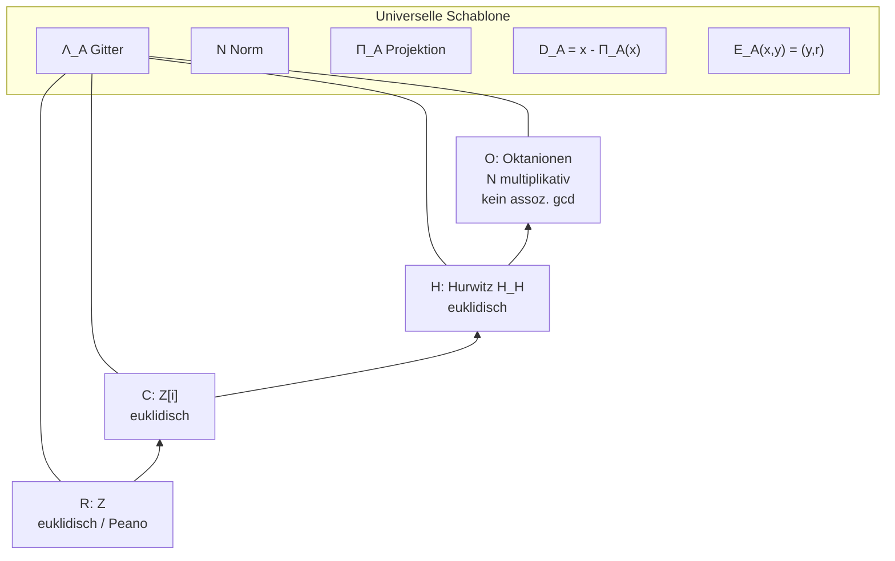

# Universelle euklidische Hebung und Norm-Defekt-Abstieg über Hurwitz-Divisionsalgebren

**Stand:** Juni 2026 · **Epistemische Warnung:** Forschungsnotiz im Tao-Stil
(Definition / Theorem / Conjecture / Forschungsvision / Experiment).
**Kein Collatz-Beweis. Kein ERPC.**

**Label-Schema:** Definition | Theorem | Conjecture | Forschungsfrage | Forschungsvision | Heuristik.

---

## Epistemische Einordnung (kritisch)

### Was der euklidische Algorithmus leistet — und was nicht

Der **klassische euklidische Algorithmus** berechnet den **ggT** (greatest common divisor) in einem
Euklidischen Ring: wiederholte Division mit Rest, bis der Rest null wird. Er **erkennt Primzahlen
nicht direkt**; Primzahlen erscheinen als **irreduzible Elemente** (keine nichttrivialen Faktoren)
in solchen Ringen — ein **Theorem** der kommutativen Algebra, kein Algorithmus-Output.

| Ebene | Inhalt | Label |
|-------|--------|-------|
| Algorithmus | $\gcd(x,y)$ via Restabstieg | **Theorem** (korrekte Terminierung in Euklidischen Ringen) |
| Primzahlen | Irreduzible in $\mathbb{Z}$; Einheiten $\pm 1$ | **Theorem** |
| „Prim = Defekt" | Norm-Rest $D(x)=x-\Pi(x)$ als minimale irreduzible Defektstruktur | **Conjecture / Forschungsvision** (§7) |

### Etabliert vs. offen

| Aussage | Status |
|---------|--------|
| $\mathbb{Z}$ ist euklidisch (Norm $|\cdot|$) | **Theorem** |
| $\mathbb{Z}[i]$ (Gaußsche Ganzzahlen) ist euklidisch | **Theorem** |
| Hurwitz-Quaternionen $\mathbb{H}_{\mathrm H}$ bilden euklidischen Ring (links/rechts assoziativ) | **Theorem** |
| Norm $N$ ist multiplikativ auf $\mathbb{R},\mathbb{C},\mathbb{H},\mathbb{O}$ | **Theorem** (Hurwitz) |
| $\mathbb{O}$ verliert Assoziativität | **Theorem** → $\gcd$/Ideale **problematisch** (links vs. rechts) | **Etabliertes Problem** |
| Universeller Norm-Defekt-Abstieg $E_A$ auf allen vier Algebren | **Forschungsfrage** (§8) |
| EABC-Primdefekte $D(x)=x-\Pi(x)$ charakterisieren Primzahlen in $\mathbb{R}$ | **Conjecture** (Verknüpfung §17) |

**Querverweise:**
- **`collatz_eabc_normabstieg_hypothese.md`** — **kanonsiche** EABC-Normabstiegs-Hypothese (§8 Gauß–EABC-Brücke, Experiment `collatz_eabc_gauss_defekt_test.py`)
- `collatz_eabc_bernoulli_uebersetzung.md` §17 (Peano-Projektion, Tetraeder-Defekte, Hurwitz-Kette) — Branch `collatz/eabc-bernoulli-sensor`
- `collatz_eabc_invarianzprogramm.md` (Fluktuationsfeld $\delta(x)$, EABC-Invarianten) — Branch `collatz/eabc-invarianzprogramm`
- `PAPER_HURWITZ_RESONANZ.md` (Hurwitz-Gitter, $\Pi_\Gamma$, Primideale in $\mathbb{H}$)
- `collatz_eabc_quaternion_mass_hypothese.md` / `collatz_eabc_hurwitz_orbit_test.py` — Normschale $\Sigma_p$, $\mu_p$, $H_p$, Chiralität (PR #54)
- `collatz_eabc_oktonion_singularitaet.md` / `collatz_eabc_oktonion_shell_stub.py` — Oktanionische $\Sigma_n^{(8)}$, $S^7$, Singularitätshypothese (PR #54)
- `Divisionsalgebren.md`, `Grundsatzartikel_Hurwitz_Raum.tex`

---

## 1. $\mathbb{R}$: Peano-Achse und klassischer euklidischer Ring

**Definition 1 ($\mathbb{Z}\subset\mathbb{R}$).** Die ganzen Zahlen $\mathbb{Z}$ sind die
Maximalordnung der reellen Divisionsalgebra $\mathbb{R}$. Die **Norm** ist $N(x)=|x|$.

**Theorem (Euklidischer Ring $\mathbb{Z}$).** Für $x,y\in\mathbb{Z}$, $y\neq 0$, existiert
$q\in\mathbb{Z}$ mit $x=qy+r$ und $N(r)<N(y)$ (klassische Division mit Rest).

**Heuristik (1D-Spezialfall).** Die Peano-Dynamik $S(n)=n+1$ projiziert die volle Struktur auf
eine Achse (vgl. `collatz_eabc_bernoulli_uebersetzung.md` §17.2). Der euklidische Algorithmus
auf $\mathbb{Z}$ ist der **eindimensionale Spezialfall** der universellen Hebung (§5–§6): Gitter
$\Lambda_{\mathbb{R}}=\mathbb{Z}$, $\Pi$ = ganzzahlige Runden/Quotientenwahl.

**Label:** Definition / Theorem; Peano-Projektion = **Heuristik** (§17).

---

## 2. $\mathbb{C}$: Gaußsche Ganzzahlen $\mathbb{Z}[i]$

**Definition 2 ($\mathbb{Z}[i]$).** Das Gitter der **Gaußschen Ganzzahlen**
\[
\Lambda_{\mathbb{C}}=\mathbb{Z}[i]=\{a+bi : a,b\in\mathbb{Z}\}
\]
ist die Maximalordnung der komplexen Divisionsalgebra $\mathbb{C}$. Norm:
$N(a+bi)=a^2+b^2$.

**Theorem.** $\mathbb{Z}[i]$ ist ein euklidischer Ring (Norm $N$). Irreduzible Elemente mit
$N(p)$ prim in $\mathbb{Z}$ liefern Primzahlen der Form $p\equiv 1\pmod 4$ (Fermat-Zwei-Quadrate).

**Label:** **Theorem** — klassische algebraische Zahlentheorie.

---

## 3. $\mathbb{H}$: Hurwitz-Quaternionen $\mathbb{H}_{\mathrm H}$

**Definition 3 (Hurwitz-Maximalordnung).** Die **Hurwitz-Quaternionen**
\[
\Lambda_{\mathbb{H}}=\mathbb{H}_{\mathrm H}
=\Bigl\{a_0+a_1 i+a_2 j+a_3 k :
\begin{aligned}
&a_i\in\mathbb{Z}\ \text{oder alle}\ a_i\in\mathbb{Z}+\tfrac12,\\
&a_0+a_1+a_2+a_3\in\mathbb{Z}
\end{aligned}
\Bigr\}
\]
bilden die euklidische Maximalordnung in der Quaternionen-Divisionsalgebra $\mathbb{H}$.
Norm: $N(q)=a_0^2+a_1^2+a_2^2+a_3^2$.

**Theorem (Hurwitz-Euklidizität).** $\mathbb{H}_{\mathrm H}$ ist links- und rechts-euklidisch
(assoziative Multiplikation). Der euklidische Algorithmus liefert $\gcd$ in Hurwitz-Idealen;
**Primzahlen** erscheinen als **irreduzible Hurwitz-Elemente** mit Primnorm
(vgl. `PAPER_HURWITZ_RESONANZ.md`: $2+i$ mit $N=5$, $2+i+j+k$ mit $N=7$).

**EABC-Identifikation (Definition, nicht Theorem):**
$E\leftrightarrow 1$, $A\leftrightarrow i$, $B\leftrightarrow j$, $C\leftrightarrow k$.

**Label:** **Theorem** (Euklidizität); EABC-Kodierung = **Definition**.

---

## 4. $\mathbb{O}$: Oktanionen und Verlust der Assoziativität

**Theorem (Hurwitz, normierte Divisionsalgebren).** Über $\mathbb{R}$ existieren genau vier
endlich-dimensionale **normierte** Divisionsalgebren:
\[
\mathbb{R}\;(1\text{D}),\quad
\mathbb{C}\;(2\text{D}),\quad
\mathbb{H}\;(4\text{D}),\quad
\mathbb{O}\;(8\text{D}).
\]
Beim Übergang $\mathbb{H}\to\mathbb{O}$ geht **Assoziativität** verloren: im Allgemeinen
$(ab)c\neq a(bc)$.

**Etabliertes Problem.** Ohne Assoziativität sind **links- und rechts-Ideale** nicht
äquivalent; ein klassischer $\gcd$-Algorithmus und eindeutige Faktorzerlegung in Idealen
sind **problematisch**. Die Hurwitz-Oktanionen-Ganzzahlen $\mathbb{O}_{\mathrm H}$ bilden
eine Zahlengitter-Struktur mit multiplikativer Norm, aber **keinen** assoziativen
Euklidischen Ring im klassischen Sinn.

**Label:** **Theorem** (Hurwitz, Nicht-Assoziativität); Ideal-/gcd-Problem = **etabliertes Problem**.

---

## 5. Universelle Hebung: Gitter, Projektion, Rest

Sei $A\in\{\mathbb{R},\mathbb{C},\mathbb{H},\mathbb{O}\}$ eine normierte Divisionsalgebra über
$\mathbb{R}$ mit **Gitter** $\Lambda_A$ (Maximalordnung wo definiert), **Norm** $N:A\to\mathbb{R}_{\ge 0}$
(multiplikativ: $N(xy)=N(x)N(y)$) und **Projektion**
\[
\Pi_A : A \longrightarrow \Lambda_A
\]
(nächster-Gitter-Punkt bzw. Quotientenprojektion im euklidischen Spezialfall).

### Definition 4 (Norm-Defekt)

\[
D_A(x) := x - \Pi_A(x).
\]
Der **Defekt** misst die Abweichung von $x$ vom Gitter — **nicht** Divisibilität im Ring.

### Definition 5 (Ein Schritt euklidischer Hebung)

Für $x,y\in\Lambda_A$, $y\neq 0$, $y$ invertierbar in $A$:

1. $z := x\,y^{-1}\in A$ (Quotient in der Algebra),
2. $q := \Pi_A(z)\in\Lambda_A$ (projizierter Quotient),
3. $r := x - q\,y\in\Lambda_A$ (Rest).

**Euklidische Bedingung (wo etabliert):** $N(r) < N(y)$.

Im **klassischen Fall** $A=\mathbb{R}$, $\Lambda_A=\mathbb{Z}$: $q=\lfloor x/y\rfloor$ (bzw.
angepasste Ganzzahl-Quotientenwahl), $r=x-qy$ — dies **ist** der euklidische Algorithmus.

**Label:** **Definition**; $N(r)<N(y)$ = **Theorem** in $\mathbb{Z},\mathbb{Z}[i],\mathbb{H}_{\mathrm H}$;
in $\mathbb{O}$ = **Forschungsfrage** (§8).

---

## 6. Universeller Operator $E_A$

### Definition 6 (Euklidischer Hebungsoperator)

\[
E_A : \Lambda_A\times(\Lambda_A\setminus\{0\}) \longrightarrow \Lambda_A\times\Lambda_A,
\qquad
E_A(x,y) := (y,\, r),
\]
wobei $r$ aus Definition 5. Iteration
\[
E_A^{(k)}(x,y) := E_A\bigl(y_{k-1},\, r_{k-1}\bigr),\quad (y_0,r_0)=(y,r)\ \text{nach erstem Schritt}
\]
erzeugt die **Abstiegskette** der Restnormen — in euklidischen Ringen terminierend beim $\gcd$.

| Algebra | $E_A$-Interpretation | Terminierung |
|---------|---------------------|--------------|
| $\mathbb{R}$ / $\mathbb{Z}$ | Klassischer euklid. Algorithmus | **Theorem** |
| $\mathbb{C}$ / $\mathbb{Z}[i]$ | Gauß-Euklid | **Theorem** |
| $\mathbb{H}$ / $\mathbb{H}_{\mathrm H}$ | Hurwitz-Euklid | **Theorem** |
| $\mathbb{O}$ / $\mathbb{O}_{\mathrm H}$ | Norm-Abstieg ohne assoziativen $\gcd$ | **offen** |

**Label:** **Definition**; Terminierung = **Theorem** (R,C,H) bzw. **Forschungsfrage** (O).

---

## 7. EABC-Verbindung: Defekte statt Divisibilität

### Conjecture (EABC-Norm-Defekt-Primstruktur)

In der **reellen Spezialisierung** ($A=\mathbb{R}$, $\Lambda_A=\mathbb{Z}$, $\Pi$ = ganzzahlige
Peano-Projektion) sei ein **Primdefekt** ein Zustand $D_{\mathbb{R}}(x)=x-\Pi(x)$, der
**nicht weiter zerlegbar** ist in kleinere Defekte unter der Hebungsdynamik — analog zu
**irreduziblen** Elementen im euklidischen Ring:

\[
p\ \text{prim in }\mathbb{Z}
\quad\Longleftrightarrow\quad
D_{\mathbb{R}}(p)\ \text{minimal irreduzibler Defektzustand}.
\]

Dies ist **stärker als Divisibilität** und **schwächer als ein Beweis**: Es formuliert eine
**Forschungsvision** parallel zu `collatz_eabc_bernoulli_uebersetzung.md` §17.6–§17.7
($\mathcal{K}(N)$, $D(N)=(E,A,B,C)$, $\mathcal{D}_{\mathrm{krit}}$).

### Brücke zum Invarianzprogramm

`collatz_eabc_invarianzprogramm.md` definiert das **EABC-Fluktuationsfeld**
$\delta(x)=(\delta_E,\ldots,\delta_C)$ und Energie $H(x)=\|\delta(x)\|_2^2$ als Abweichungen
von der äquidistanten Referenz. Die **Defekt-Hebung** $D_A(x)=x-\Pi_A(x)$ ist die
**algebraische** Seite desselben Bildes: Peano-Projektion $\Pi$ auf $\mathbb{N}$ vs.
vierkanalige EABC-Fluktuation $\delta$ auf $\Delta_3$.

| Objekt | Träger | Projektion | Defekt |
|--------|--------|------------|--------|
| Peano / Prim | $\mathbb{Z}\subset\mathbb{R}$ | $\Pi_{\mathbb{R}}$ | $D_{\mathbb{R}}(x)=x-\Pi(x)$ |
| EABC-Fluktuation | $\Delta_3$ | Mittelwert $1/4$ | $\delta(x)$, $H(x)$ |
| Hurwitz / EABC | $\mathbb{H}_{\mathrm H}$ | $\Pi_{\mathbb{H}}$ | $D_{\mathbb{H}}(q)=q-\Pi(q)$ |

**Label:** Prim-Defekt-Äquivalenz = **Conjecture / Forschungsvision**; Fluktuationsfeld = **Definition** (Invarianzprogramm).

---

## 8. Forschungsfrage: universeller Norm-Abstieg (nicht „Euklid auf Oktanionen")

> **Forschungsfrage (zentrale).** Die offene Frage ist **nicht**, ob man einen klassischen
> euklidischen Ring auf den Oktanionen erzwingen kann, sondern ob es einen **universellen
> Norm-Defekt-Abstieg** gibt, der für jede Hurwitz-Divisionsalgebra $A\in\{R,C,H,O\}$
> konsistent definiert ist:
> \[
> \mathbb{R}\subset\mathbb{C}\subset\mathbb{H}\subset\mathbb{O},
> \]
> jeweils mit Gitter $\Lambda_A$, Norm $N$, Projektion $\Pi_A$, Defekt $D_A$ und Operator $E_A$.

### Spezialisierung vs. Universalität

| Lesart | Inhalt |
|--------|--------|
| **Klassisch (1D)** | $A=\mathbb{R}$, $\Lambda=\mathbb{Z}$: euklidischer Algorithmus = $\gcd$ |
| **Universal** | Dieselbe Schablone $(z,q,r)$ mit $N(r)<N(y)$ wo möglich; Defekte $D_A$ als primäres Objekt |
| **Oktanionen** | Normmultiplikativität bleibt; assoziativer $\gcd$ fällt weg → **Defekt-Abstieg** statt Ideal-Theorie |

### Offene Teilfragen

1. **Existenz** einer kanonischen $\Pi_{\mathbb{O}}$ auf $\mathbb{O}_{\mathrm H}$ mit
   $N(D_{\mathbb{O}}(x))$-Abstieg?
2. **Verknüpfung** $D_{\mathbb{H}}$ mit EABC-Primideal-Resonanz (`PAPER_HURWITZ_RESONANZ.md`)?
3. **Projektion** der vierkanaligen Defekte $D(N)=(E,A,B,C)$ (§17) auf die Hurwitz-Kette?
4. **Lean-Formalisation** von $E_A$ als generischer Operator (Spezialfall $\mathbb{Z}$ zuerst)?

**Label:** **Forschungsfrage** — kein Theorem, kein Collatz-Beweisanspruch.

---

## 9. Kette $\mathbb{R}\subset\mathbb{C}\subset\mathbb{H}\subset\mathbb{O}$

**Boxed (Zusammenfassung):**

$$\boxed{
\text{Euklidischer Algorithmus} = \gcd\text{-Spezialfall von } E_{\mathbb{R}};
\quad
\text{Prim} = \text{irreduzibel in } \Lambda_A;
\quad
\text{EABC-Prim} \stackrel{?}{=} \text{minimaler Norm-Defekt } D_{\mathbb{R}};
\quad
\mathbb{O}\text{: Defekt-Abstieg statt gcd.}
}$$

---

## 10. Implementierung und Querverweise

| Artefakt | Rolle |
|----------|-------|
| `collatz_eabc_normabstieg_hypothese.md` | **Kanonsiche** Normabstiegs-Hypothese; Gauß–EABC-Teilhypothese §8 |
| `collatz_eabc_gauss_defekt_test.py` | Experiment: split/inert in $\mathbb{Z}[i]$ vs.\ EABC-Klassen |
| `collatz_eabc_euklid_hebung.py` | Minimal-Stub: ein euklidischer Schritt in $\mathbb{Z}$, $\mathbb{Z}[i]$; $D(q)$ für Hurwitz |
| `Hurwitz 24.py` | 24 Hurwitz-Einheiten, Quaternionen-Arithmetik |
| `collatz_eabc_hurwitz_orbit_test.py` | Schalenmaß $\mu_p$ auf $\Sigma_p$, $U_{\mathrm H}$-Orbits, volle $\Gamma$ |
| `collatz_eabc_quaternion_mass_hypothese.md` | **Kanonsiche** Quaternionen-EABC-Maßhypothese §1–§13 |
| `collatz_eabc_oktonion_singularitaet.md` | Oktanionische EABC-Singularitätshypothese ($\Sigma_n^{(8)}$, $S^7$) |
| `collatz_eabc_oktonion_shell_stub.py` | Stub: $r_8(n)$ für kleines $n$ (kein $\mu_n$) |
| `collatz_eabc_hurwitz_spaltung.md` | Redirect → Maßhypothese |
| `PAPER_HURWITZ_RESONANZ.md` | $\Pi_\Gamma$, Primideale, Resonanz |
| `collatz_eabc_bernoulli_uebersetzung.md` §17 | Defekt-Tetraeder, Kepler-Füllung, $\mathcal{D}_{\mathrm{krit}}$ |
| `collatz_eabc_invarianzprogramm.md` | Fluktuationsfeld $\delta$, $\chi_{\mathrm{fluct}}$, $H(x)$ |
| `collatz_generalangriff_2026.md` | Strategischer Pointer (parallel zu Brücke L, kein Beweispfad) |
| `collatz_hurwitz_polytop_eabc.tex` | Hurwitz-Polytop / EABC-Geometrie |

---

*Epistemische Einordnung: Theoreme zu $\mathbb{Z},\mathbb{Z}[i],\mathbb{H}_{\mathrm H}$ und Hurwitz
sind nicht verhandelbar; EABC-Prim-Defekt-Äquivalenz und universeller Oktanionen-Abstieg sind
explizit offen. Kein Collatz-Beweis. Kein ERPC.*
