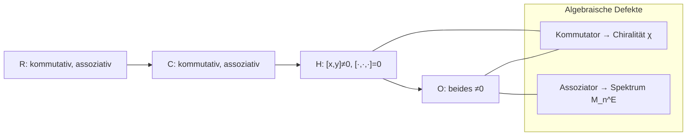

# Kommutator vs. Assoziator — EABC-Rahmen über die Hurwitz-Kette

**Status:** Heuristik + Definitionen (kein rigoroses DG-Framework)  
**Branch:** `collatz/eabc-euklidische-hebung` (PR #54)  
**Tao-Labels:** Definition | Theorem | Heuristik | Conjecture | Experiment (geplant)

**Querverweise:**
- `collatz_eabc_euklidische_hebung.md` — Hurwitz-Kette $\mathbb{R}\subset\mathbb{C}\subset\mathbb{H}\subset\mathbb{O}$, Norm-Defekt $D_A$, Hebungsoperator $E_A$
- `collatz_eabc_quaternion_mass_hypothese.md` §7 — **Chiralität** $\chi_p$ auf $\Sigma_p$ (operatives Quaternion-Programm)
- `collatz_eabc_oktonion_assoziator_spektralhypothese.md` — **Assoziator-Spektrum** $M_n(t)$, $M_n^E(t)$, $\hat D_E(s)$
- `collatz_eabc_oktonion_associator.py` / `collatz_eabc_oktonion_spectrum.py` — Oktanion-Experimente
- `collatz_eabc_discrete_associator.md` / `collatz_eabc_discrete_associator.py` — **diskreter** $V_4$-Assoziator ($\Phi$ mod $12$, $\mathfrak a\equiv 0$)
- `collatz_eabc_quaternion_commutator_stub.py` — Kommutator-Norm-Stub auf $\mathbb{H}$ ($n\le 20$)

---

## 1. Zwei algebraische Defekte: Reihenfolge vs. Klammerung

**Definition (Kommutator — Reihenfolge-Defekt).**
$$[x,y] := xy - yx.$$

**Definition (Assoziator — Klammerungs-Defekt).**
$$[x,y,z] := (xy)z - x(yz).$$

| Defekt | Typ | Misst |
|--------|-----|-------|
| **Kommutator** $[x,y]$ | **binär** | Nichtvertauschbarkeit von $x$ und $y$ (Reihenfolge) |
| **Assoziator** $[x,y,z]$ | **ternär** | Nichtassoziativität der Multiplikation (Baum-/Klammerstruktur) |

**Label:** beide = **Definition**.

---

## 2. Beispiele entlang der Hurwitz-Kette

### $\mathbb{R}$ und $\mathbb{C}$

**Theorem.** In jeder **kommutativen** assoziativen Algebra gilt $[x,y]=0$ und $[x,y,z]=0$ für alle $x,y,z$.

### $\mathbb{H}$ (Quaternionen)

**Theorem (Quaternionen-Multiplikation).** Mit $i,j,k$ und $ij=k$:
$$ij = k,\qquad ji = -k.$$
Also $[i,j] = ij - ji = 2k \neq 0$ — **Nichtkommutativität**.

**Theorem (Assoziativität).** $\mathbb{H}$ ist assoziativ: $[x,y,z]=0$ für alle $x,y,z\in\mathbb{H}$.

### $\mathbb{O}$ (Oktanionen)

**Theorem (Nichtassoziativität).** Für generisches Tripel (z.\,B. $e_1,e_2,e_4$ in der Standardbasis):
$$[e_1,e_2,e_4] = (e_1 e_2)e_4 - e_1(e_2 e_4) \neq 0.$$
**Experiment:** `collatz_eabc_oktonion_associator.py::canonical_triples_test`.

**Label:** Quaternionen-Kommutator = **Theorem**; Oktanion-Assoziator $\neq 0$ = **Theorem** + **Experiment**.

---

## 3. Übersichtstabelle: Verlust entlang $\mathbb{R}\to\mathbb{C}\to\mathbb{H}\to\mathbb{O}$

| Algebra | $\dim$ | Kommutator $[x,y]$ | Assoziator $[x,y,z]$ | Euklidischer Ring? |
|---------|--------|--------------------|----------------------|--------------------|
| $\mathbb{R}$ | 1 | $\equiv 0$ | $\equiv 0$ | ja ($\mathbb{Z}$) |
| $\mathbb{C}$ | 2 | $\equiv 0$ | $\equiv 0$ | ja ($\mathbb{Z}[i]$) |
| $\mathbb{H}$ | 4 | **typisch $\neq 0$** | $\equiv 0$ | ja ($\mathbb{H}_{\mathrm H}$) |
| $\mathbb{O}$ | 8 | **typisch $\neq 0$** | **typisch $\neq 0$** | **nein** (gcd/Ideale problematisch) |

**Heuristik (Verlustkaskade).**
- $\mathbb{C}\to\mathbb{H}$: Verlust der **Kommutativität** (Reihenfolge wird messbar).
- $\mathbb{H}\to\mathbb{O}$: Verlust der **Assoziativität** (Klammerung/Baum wird messbar).

**Label:** Tabelle = **Theorem** (Algebra) + **Heuristik** (EABC-Interpretation, §4).

---

## 4. EABC-Lesart: Chiralität vs. Hierarchie

Im EABC-Programm werden die beiden Defekte **operativ** unterschieden:

| Algebraischer Defekt | EABC-Interpretation | Operatives Observable (bestehend) |
|----------------------|---------------------|-----------------------------------|
| **Kommutator** $[x,y]$ | **Chiralitäts- / Orientierungsdefekt** — vertauschte Reihenfolge kehrt Vorzeichen/Orientierung um | $\chi_p$ auf $\Sigma_p$ (`collatz_eabc_quaternion_mass_hypothese.md` §7; `collatz_eabc_hurwitz_orbit_test.py`) |
| **Assoziator** $[x,y,z]$ | **Hierarchie- / Baumdefekt** — verschiedene Klammerung erzeugt verschiedene $\Gamma$-Projektion | $M_n^E(t)$, $\mathfrak{a}_E(n)$ (`collatz_eabc_oktonion_assoziator_spektralhypothese.md`) |

**Heuristik (nicht rigoros).** Der Kommutator misst **lokale Torsion** (Paar-Vertauschung); der Assoziator misst **globale Krümmung** im Sinne einer Baumabhängigkeit der Multiplikation — **ohne** Anspruch auf ein formales Differentialgeometrie-Modell.

> **Boxed (Heuristik, kein DG-Theorem).**
> $$\boxed{\;\text{Kommutator} = \text{algebraische Torsion};\qquad
> \text{Assoziator} = \text{algebraische Krümmung}.\;}$$
> Diese Metapher dient der **Orientierung** im EABC-Programm, nicht einem bewiesenen DG-Framework.

**Label:** EABC-Lesart = **Heuristik**; $\chi_p$, $M_n^E$ = **Definition** / **Experiment**.

---

## 5. Verknüpfung mit der Hurwitz-Hebungskette

`collatz_eabc_euklidische_hebung.md` formuliert die universelle Schablone
$(\Lambda_A,\, N,\, \Pi_A,\, D_A,\, E_A)$ über $A\in\{\mathbb{R},\mathbb{C},\mathbb{H},\mathbb{O}\}$.

Die Kommutator-/Assoziator-Perspektive **ergänzt** die Norm-Defekt-Hebung um **zweite und dritte Ordnung** der Multiplikation:

| Stufe | Norm-Defekt $D_A(x)$ | Kommutator | Assoziator |
|-------|----------------------|------------|------------|
| $\mathbb{R}$ | Peano-Projektion / Prim-Defekt | trivial | trivial |
| $\mathbb{C}$ | Gauß-Defekt | trivial | trivial |
| $\mathbb{H}$ | Hurwitz-Defekt | **$\chi_p$** (Schalen-Chiralität) | trivial |
| $\mathbb{O}$ | offen (kein assoz. gcd) | nontrivial | **$M_n^E(t)$** (Spektralhypothese) |

---

## 6. Forschungsprogramm: was existiert, was fehlt

### Quaternionen ($\mathbb{H}$) — Kommutator-Seite **teilweise abgedeckt**

Das bestehende Programm hat bereits ein **chirales** Observable:
$$\chi_p = \sum_\gamma \chi(\gamma)\,\mu_p(\gamma)$$
auf der Normschale $\Sigma_p$ (`collatz_eabc_quaternion_mass_hypothese.md` §7).

**Geplant (Experiment, nicht implementiert):** **Kommutator-Spektrum** auf $\Sigma_n\times\Sigma_n$:
$$C_n(t) := \#\bigl\{(x,y)\in\Sigma_n^2 : N([x,y])=t\bigr\},\qquad
\alpha_{\mathrm{com}}(x,y) := N(xy-yx).$$
Stub: `collatz_eabc_quaternion_commutator_stub.py` zeigt für $n\le 20$, dass $\alpha_{\mathrm{com}}(x,y)>0$ **generisch** auf $\Sigma_n$ (nicht nur für Basiselemente $i,j$).

**Label:** $\chi_p$ = **Experiment**; Kommutator-Spektrum $C_n$ = **Conjecture** / geplantes **Experiment**.

### Diskretes $V_4$ — Assoziator **trivial** (PR #54)

Auf der sichtbaren EABC-Ebene $\{E,A,B,C\}$ mit $\Phi(X,Y)=\mathrm{classOf}(\mathrm{residue}(X)\cdot\mathrm{residue}(Y))$
ist $\Phi$ die Klein-Vierergruppe — **assoziativ**, $\mathfrak a\equiv 0$ für alle $4^3$ Tripel
(`collatz_eabc_discrete_associator.md`, **Theorem**). ABCE/CEAB markieren dort nur eine
**Heuristik** der Klammerlesart, keinen algebraischen Defekt.

**Label:** $V_4$-Trivialität = **Theorem**; ABCE/CEAB-Klammer = **Heuristik**.

### Oktanionen ($\mathbb{O}$) — **beide** Defekte relevant

Beim Übergang $\mathbb{H}\to\mathbb{O}$ bleibt Nichtkommutativität erhalten **und** tritt Nichtassoziativität hinzu.
Das Oktanion-Programm fokussiert daher primär den **Assoziator** ($M_n$, $M_n^E$, $\hat D_E$), weil dies der **neue** algebraische Defekt ist.

**Offen:** Verknüpfung Kommutator-Spektrum **und** Assoziator-Spektrum auf gemeinsamen Platten $\Sigma_n$ (`collatz_eabc_plattenuebergang.md`).

**Label:** Assoziator-Spektralhypothese = **Conjecture** (`collatz_eabc_oktonion_assoziator_spektralhypothese.md` §6).

---

## 7. Epistemische Einordnung

| Aussage | Label |
|---------|-------|
| $[x,y]$, $[x,y,z]$ | **Definition** |
| Trivialität in $\mathbb{R},\mathbb{C}$; $[i,j]\neq 0$ in $\mathbb{H}$; Assoziator $=0$ in $\mathbb{H}$ | **Theorem** |
| Assoziator $\neq 0$ in $\mathbb{O}$ | **Theorem** + **Experiment** |
| Kommutator = Torsion, Assoziator = Krümmung | **Heuristik** (kein DG) |
| $\chi_p$ als chirales Schalen-Observable | **Definition** / **Experiment** |
| $M_n^E$, Oktonionische Assoziator-Spektralhypothese | **Conjecture** |
| Kommutator-Spektrum $C_n$ auf $\mathbb{H}$ | **Conjecture** / geplantes **Experiment** |
| `collatz_eabc_quaternion_commutator_stub.py` | **Experiment** (Stub, $n\le 20$) |

---

*Kanonsiche Notiz: Die Hurwitz-Kette verliert zuerst Kommutativität ($\mathbb{C}\to\mathbb{H}$), dann Assoziativität ($\mathbb{H}\to\mathbb{O}$). Das Quaternion-Programm adressiert den ersten Verlust über $\chi_p$; das Oktanion-Programm den zweiten über $M_n^E$. Ein vollständiges 8D-Bild verlangt künftig **beide** Spektren — mit expliziter Warnung, dass die Torsion/Krümmung-Metapher heuristisch bleibt.*
