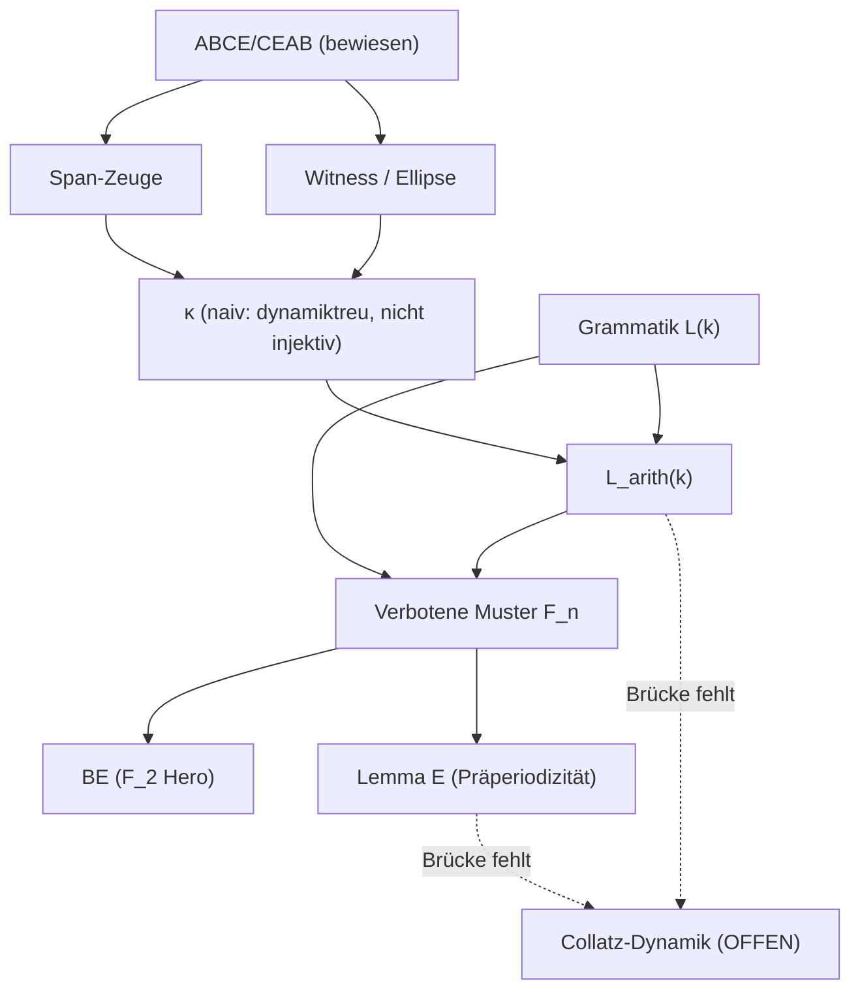

# Generalangriff Collatz (Juni 2026) — Forschungsreport

**Ziel:** Die kleinste noch fehlende Brücke **L** identifizieren, sodass
*(bewiesene EABC-/Lean-Struktur)* **+ L** ⟹ Collatz (odd-to-odd:
$\forall n$ ungerade $\exists K: U^K(n)=1$).

**Epistemische Warnung:** Dieses Dokument ist ein **Forschungsplan**, kein Collatz-Beweis.
Die Collatz-Vermutung bleibt offen.

**Methodik:** Lean als Wahrheitsfilter im Tao-Stil (IEANTN/PNT+-Parallele, ICERM Mai 2026) —
siehe `collatz_formalisierung_tao_stil.md` (explizite Zeugenmengen, living spreadsheet,
Sicherheitsmargen, Negativtests, PR-Kultur statt impliziter Heuristikverschmelzung).

---

## Ziel und Erfolgskriterium

> **Kleinste fehlende Brücke L:**  
> *(Bewiesene EABC-/Lean-Struktur)* **+ L** ⟹ Collatz.

**Erfolgskriterium:** L ist

1. **logisch schwächer** als volle Collatz-Vermutung (oder eine äquivalente, aber operationalisierbare Zerlegung),
2. **nicht** bereits durch lokale Grammatik, Dichte oder Markov-Heuristiken impliziert,
3. **Lean-formalisierbar** (mindestens als `Prop` mit klarer Beweisstrategie),
4. schließt die dokumentierte Lücke *endliche EABC-Grammatik ⇒ Ausschluss unendlich schlechter natürlicher Realisierungen*.

**Kernfeststellung:** Die bewiesene Struktur kontrolliert **Präfixe, Wörter und typische Bahnen** —
nicht den punktweisen Ausschluss von $E_\infty$. Jede minimal plausible L muss daher den Sprung von
*lokal zulässig* zu *global für jedes $n\in\mathbb{N}_{\mathrm{odd}}$ realisiert* leisten.

> **Boxed (Generalangriff):** Finde die **minimale Brücke** zwischen $E_\infty$ und $\mathbb{N}$.

**PR-Bedeutung (Generalangriff 2026):** EABC $\not\Rightarrow$ Collatz — aber
*(bewiesene EABC-/Lean-Struktur)* **+ kleine Brücke L** $\Rightarrow$ Collatz.

---

## Generalangriff auf Forschungsorganisation (Tao-Stil)

**Gegenstand:** Nicht Collatz direkt, sondern die **Forschungsorganisation** —
welche Objekte gesund sind, welche Evidenz sauber, welche Brücken fehlen, und
wo der nächste messbare Angriff liegt. Methodik: Definition / Zeuge / Experiment /
Theorem / Conjecture strikt trennen (`collatz_formalisierung_tao_stil.md`).

### Drei Ebenen (Stand Juni 2026)

| Ebene | Inhalt | Status |
|-------|--------|--------|
| **A — Formale Objekte** | EABC, ABCE/CEAB, Span, Witness, Ellipse, $\kappa$, $\mathcal{L}(k)$, $\mathcal{L}_{\mathrm{arith}}(k)$ | **gesund** — Lean/Python-Schnittstellen, klare `Prop`-Grenzen |
| **B — Numerische Evidenz** | Präzession negativ ($r\approx -0{,}18$); $\Phi_{\mathrm{pref}}$ Länge 4 trivial; naive $\kappa$ nicht injektiv; $w=\mathrm{BE}$; Ratio $\approx 0{,}87\,\%$ bei $k=10$ | **sauber** — Negativtests dokumentiert, keine Heuristikverschmelzung |
| **C — Fehlende Brücken** | Arithmetik $\to \kappa \to \mathcal{L}_{\mathrm{arith}}$ operationalisiert | **Lücke:** $\mathcal{L}_{\mathrm{arith}} \to$ Collatz-Dynamik fehlt |

### Neue Pipeline (nicht mehr nur $\kappa\to L_{\mathrm{arith}}\to$ Lemma E)

$$\boxed{\text{Arithmetik} \;\to\; \kappa \;\to\; \mathcal{L}_{\mathrm{arith}}
\;\to\; \textbf{Verbotene Muster } F_n \;\to\; \textbf{Dynamische Konsequenzen}}$$

Lemma E bleibt **ein** möglicher Endpunkt der Kette, nicht die einzige. Der operative
Mittelteil ist die **arithmetische Grammatik** hinter zulässigen Collatz-Wörtern.

### Strategische Verschiebung

| Alt | Neu |
|-----|-----|
| Attraktor $E$ / Uniformität suchen | **Arithmetische Grammatik** hinter zulässigen Collatz-Wörtern |
| Einzelkette $\kappa\to L_{\mathrm{arith}}\to$ Lemma E | Pipeline mit **verbotenen Mustern** $F_n$ und dynamischen Konsequenzen |
| Geometrie als Hauptangriff | Geometrie epistemisch abgegrenzt; **$F_n$-Katalog** als Nullstellenkatalog; Morley als **Sensor** ($F_M$, $S_M$, $K_M$) — `collatz_morley_metrik_erweiterung.md` |

### Vier Angriffspunkte (PR #39)

| # | Angriff | Artefakt | Frage |
|---|---------|----------|-------|
| **1** | **$F_n$ katalogisieren** | `collatz_forbidden_words.py` $\to$ `collatz_forbidden_words.json` | Minimale verbotene Wörter $F_n = \mathcal{L}(n)\setminus\mathcal{L}_{\mathrm{arith}}(n)$; $\mathrm{BE}$ als Hero ($F_2$) |
| **2** | **$R(k)=|L_{\mathrm{arith}}\cap L|/|L|$** | Ratios $k=4,8,10$ | Strebt $R(k)\to 0$? (Conjecture-Ebene) |
| **3** | **Dependency Graph** | unten | ABCE $\to$ Span/Witness/$\kappa$ $\to$ $L_{\mathrm{arith}}$ $\to$ BE,$F_3$,$F_4$ $\to$ Lemma E |
| **4** | **Große Läufe** $n\leq 10^7$ | `collatz_forbidden_words.json` | BE stabil? Ratios? neue Gegenbeispiele? |

### Dependency Graph (Forschungsorganisation)

### $F_n$-Katalog (Experiment, $n\leq 10^7$)

$F_n := \mathcal{L}(n)\setminus\mathcal{L}_{\mathrm{arith}}(n)$ auf Suchtiefe ungerade $n\leq 10^7$.
Vollständige Enumeration für $n\leq 8$ (`enumeration_complete: true`).

| $n$ | $|F_n|$ | $|L(n)|$ | Hero / Anfang |
|-----|---------|----------|---------------|
| 2 | 1 | 8 | **BE** |
| 3 | 6 | 23 | ABE, BEA, BEB, BEE, CEA, EBE |
| 4 | 38 | 89 | AABE, … |
| 5 | 183 | 410 | AAABE, … |
| 6 | 807 | 2091 | AAAABE, … |
| 7 | 3402 | 11589 | AAAAABE, … |
| 8 | 13924 | 68753 | AAAAAABE, … |

**$R(k)$ bei $n\leq 10^7$:** $R(4)\approx 0{,}539$; $R(8)\approx 0{,}057$; $R(10)\approx 0{,}012$.
BE bleibt bei $10^7$ **stabil** (nicht realisiert). Ob $R(k)\to 0$ — **offen** (Conjecture).

---

## Bekannter Stand

### Ebene A — bewiesen (arithmetischer Kern)

| Resultat | Beleg |
|----------|-------|
| mod-12 EABC-Klassifikation, ABCE/CEAB-Chiralität | `EABC.lean`, `Projektionszeuge.tex`, `CollatzEabc.Primvierling.*` |
| C-Ketten endlich, $B\to B$ verboten, $C^*_{\max}\to EA$ | `collatz_schlussartikel_arxiv.tex`, `CollatzEabc.Density` |
| LTE-Reset (gerades $N$), LTE-Worst-Familie | `CollatzEabc.Uniformity`, `collatz_uniformity.lean` |
| C-Ketten-Dichte $N/2^k$, Tail-Reihe $(1-p)^n\to 0$ | `collatz_density_appendix.lean` |

### Collatz-Struktur (Lean, sorry-frei bis Stufe D)

- `ExceptionSetInfinity` = $E_\infty$; Collatz $\Leftrightarrow$ $E_\infty=\emptyset$ (`CollatzEabc.Open`)
- `ExceptionSet` / `ExceptionSetDiag` = $E_{\mathrm{diag}}$ — **nicht** Collatz-äquivalent ($n=27$)
- Stufen A–D: Metrik, `ExceptionSetApprox`, Monotonie, $U$-Invarianz (`CollatzEabc.Z2Attraktor`)
- Stufe E: `collatzUniformityConjecture` — offen (`collatz_z2_attraktor.lean` Zeilen 431–467 mit `sorry`)

### Negativresultate / No-Go (Forschungsauftrag E)

| Idee | Status |
|------|--------|
| $\mathrm{dist}_2(n,1)\geq c\cdot 2^{-\log n}$ | **widerlegt** (LTE $4\cdot 3^r-1$, `dist_to_one_not_uniform_bound`) |
| Drift $\Lambda\approx -0{,}830$, mod-12-Mischung | nur **stationär/fast-sicher**, nicht punktweise |
| Bernoulli-Normschale als Lyapunov | **No-Go** |
| Präzession $I(Q)\to\Pi(Q)$ | **negativ** ($r\approx -0{,}18$; `collatz_praezession_info.tex`) |
| $\Phi_{\mathrm{pref}}$ Länge 4 | **trivial** (nur ABCE/CEAB) |
| $E_{\mathrm{diag}}\cap\mathbb{N}=\emptyset$ | **falsche Zielsetzung** |

### Φ_pref-Diskriminantentest (Auftrag D, explorativ)

`collatz_phi_pref_test.json`: bei Integrationsstrom-Wörtern (nicht Länge 4) **zwei chirale Röhren**
$T_{\mathrm{ABCE}}/T_{\mathrm{CEAB}}$ vs. diffuse Zufallsdaten — **geometrische Evidenz**, kein Collatz-Beweis.
Dynamische Brücke $\Phi=\Phi_{\mathrm{pref}}\circ\kappa$ und Kodierung $\kappa:\mathbb{Z}_2\to\{E,A,B,C\}^{<\omega}$
bleiben **offen** (`collatz_kepler_gedankenexperiment.tex`).

---

## Forschungsaufträge A–E als Arbeitsplan

| Auftrag | Inhalt | Konkrete nächste Schritte |
|---------|--------|--------------------------|
| **A** | Minimales Zwischenlemma | Lemma E formalisieren; Verbindung $E_{N,N}$ ↔ Trajektorientail |
| **B** | Symbolische Dynamik $\mathcal{L}\subset\{E,A,B,C\}^{\mathbb{N}}$ | $\mathcal{L}_{\mathrm{fin}}$ aus bewiesenen Regeln axiomatisieren; Realisierungsabbildung $w(n)$ definieren |
| **C** | $E_\infty$ vs. Approximationen | Dreier-Trennung $E_{\mathrm{diag}}, E_{\mathrm{tail}}, E_\infty$ (`collatz_equivalenz_e_infty.tex`); Lean-Brücke `ExceptionSetInfinity` ≠ `ExceptionSetDiag` |
| **D** | $\Phi_{\mathrm{pref}}$ mit echtem Diskriminantentest | Wörter aus Bahn-Präfixen $\kappa_K(n)$, nicht nur Primvierling-Länge 4; Kriterium aus `collatz_kepler_gedankenexperiment.tex` |
| **E** | Falsifikation | Drift/Uniformität/Präzession/Bernoulli nicht weiter als Hauptangriff; negative Tests dokumentieren |

---

## Strategische Verfeinerung (Juni 2026)

### Lücken-Diagnose

Die verbleibende Lücke liegt **nicht** bei mod-12, Chiralität oder Geometrie (diese Ebenen sind
gesichert bzw. epistemisch abgegrenzt), sondern beim **Übergang strukturell → punktweise**:
von lokal zulässigen EABC-Wörtern und typischen Bahnen zu einer Aussage über **jedes**
$n\in\mathbb{N}$ (odd-to-odd).

### Top-5 neu eingordnet (Priorität Juni 2026, nach Stufe 2B)

| Rang | Kandidat | Status | Stufe |
|------|----------|--------|-------|
| **1** | **Kodierungsfreie $\mathcal{L}_{\mathrm{arith}}$** / $\mathcal{L}_{\mathrm{arith}}^*$ | zentral offen | **3** |
| **2** | **$R(k)\to 0$** (Dünnheits-Conjecture) | experimentell gestützt, kein Theorem | **3** |
| **3** | **Entropie $h_F$** | Schätzer $\approx 1{,}19$; κ-robust? | **3** |
| **4** | **Dynamische Konsequenzen** ($F_n \to$ Trajektorien) | Brücke fehlt | Pipeline |
| **5** | **Lemma E** (Präperiodizität) | TeX-Skizze | später |

Stufe 2/2B (PR #39/#40) ist **abgeschlossen**: $\mathcal{L}_{\mathrm{arith}}\subsetneq\mathcal{L}$ gesichert,
BE als kodierungsunabhängiger Zeuge **widerlegt**. Nächster Angriff: **Kodierungsinvarianz**, nicht Collatz.

### Warum $\kappa$ (Stufe 1) weiterhin zentral?

Drei Abbildungen aus demselben $n$:

- $n \mapsto$ Parität $\mapsto$ EABC-Blockschritt,
- $n \mapsto \Phi_{\mathrm{pref}}(\kappa(\cdot))$,
- $n \mapsto \mathbb{Z}_2$ (2-adische Metrik).

**Frage:** Geht dabei Information verloren? Eine **treue** Kodierung $\kappa$ würde die Collatz-Frage
in eine **symbolische** Frage über EABC-Wörter übersetzen — und damit Auftrag B (Grammatik) mit
Auftrag D ($\Phi_{\mathrm{pref}}$) verbinden.

Konkrete Stufe-1-Prüfpunkte:

1. Ist $\kappa$ **injektiv** (auf relevanten Präfixen)?
2. Ist $\kappa$ **dynamiktreu** (Präfixe von $\kappa(U^k(n))$ = EABC-Blockschritte der Bahn)?
3. Wo genau tritt **Informationsverlust** auf ($n \to$ Parität $\to$ EABC vs. $n \to \mathbb{Z}_2$)?

### $\mathcal{L}_{\mathrm{arith}}\subsetneq\mathcal{L}$

Nicht jedes grammatisch zulässige Wort $w\in\mathcal{L}$ ist **arithmetisch realisierbar**
als Bahnwort $w(n)$ eines $n\in\mathbb{N}_{\mathrm{odd}}$. Schlechte **unendliche** Wörter können
formal in $\mathcal{L}^{\mathbb{N}}$ liegen, ohne dass ein natürliches $n$ sie realisiert —
das ist die operationale Form der Brücke (vgl. L₂, `collatz_equivalenz_e_infty.tex`).

### Generalangriff-Prioritäten (Stufe 3, Juni 2026)

| Rang | Stufe | Status | Kernfrage |
|------|-------|--------|-----------|
| **1** | Kodierungsinvarianz | **aktiv** | Welche Eigenschaften überleben κ-Wechsel? $\mathcal{L}_{\mathrm{arith}}^*$? |
| — | $\mathcal{L}_{\mathrm{arith}}\subsetneq\mathcal{L}$ | **abgeschlossen** (PR #39) | Massive Verdünnung gesichert |
| — | κ-Robustheit / BE-Negativtest | **abgeschlossen** (PR #40) | BE nicht kodierungsunabhängig |
| **5** | Lemma E | später | Präperiodizität — nicht Stufe-3-Kern |

**Aktueller Fokus:** `collatz_stufe3_kappa_invarianz.md` (Branch `collatz/kappa-invarianz-stufe3`) — Fragen A/B/C, fünf definitorische Fragen, keine Collatz-Beweisansprüche.
Treue $\kappa$ (Stufe 1) und Geometrie/Präzession sind **zurückgestellt** (epistemisch abgegrenzt).

### Stufe 1 — Implementierung (Juni 2026)

- **Lean:** `CollatzEabc.Kappa` — `kappaPrefix`, `FaithfulKappa`, `kappaConjecture`; Theorem `naiveKappa_shift`.
- **Python:** `collatz_kappa_test.py` — bei $K=8$, $n\leq 5000$: viele Starts mit `none` (mod $12\notin\{1,5,7,11\}$),
  Kollisionen unter definierten Starts; **Dynamik-Shift** für naive $\kappa$ verifiziert.
- **Fazit:** Treue $\kappa$ ist **stärker** als naive Präfix-Kodierung; `faithfulKappaExists K` bleibt offen.

---

## Kandidaten-Lemmas

### L₁ — Lemma E (Präperiodizität) ⭐ strategischer Kandidat

**Exakte Aussage** (`collatz_equivalenz_e_infty.tex`, Zeilen 204–211):

Sei $(n_k)$ eine odd-to-odd-Bahn mit $n_{k+1}=U(n_k)$. Falls
$$\forall N\;\exists k\geq N:\quad n_k\in E_{N,N},$$
dann ist $(n_k)$ **präperiodisch**.

| | |
|---|---|
| **Stärke** | **Schwächer** als Collatz (allein); zusammen mit Zyklus-Ausschluss und Divergenz-Ausschluss potenziell äquivalent |
| **Bewiesen** | Hypothese, Skizze in TeX; **nicht** in Lean |
| **Fehlt** | Vollständiger Beweis; Klarstellung, ob divergente Bahnen die Prämisse überhaupt erfüllen (vermutlich **nein** → Lemma E deckt eher Zyklus/Präperiodizität ab, nicht Divergenz) |
| **Lean** | **mittel–hoch** — $E_{N,N}$=`ExceptionSetApprox N N`, `iterateU` vorhanden; Präperiodizität als `∃ p, q, n_{p+i}=n_{q+i}` |

**Strategischer Wert:** Reduziert „dauerhaft schlecht auf endlicher Skala“ auf Analyse **präperiodischer EABC-Wörter**;
nichttriviale Zyklen sind durch Produktformeln stark eingeschränkt (Literatur + TeX-Epilog).

---

### L₂ — Arithmetisches Realisierbarkeits-Lemma (symbolische Collatz-Form)

**Exakte Aussage** (`collatz_equivalenz_e_infty.tex`):

Sei $\mathcal{L}\subset\{E,A,B,C\}^*$ die von lokalen Regeln erzeugte formale Sprache ($BB\notin\mathcal{L}$,
endliche $C$-Ketten, $C^*_{\max}\to EA$, …). Für jedes ungerade $n$ sei $w(n)\in\{E,A,B,C\}^{\mathbb{N}}$
das Bahnwort. Dann:
$$\nexists n\in\mathbb{N}_{\mathrm{odd}}:\; w(n)\in\mathcal{L}^{\mathbb{N}}\text{ und }U^K(n)\neq 1\;\forall K.$$

| | |
|---|---|
| **Stärke** | **Äquivalent** zu Collatz / $E_\infty=\emptyset$ |
| **Bewiesen** | Lokale Grammatik-Regeln (Teilmenge von $\mathcal{L}$) |
| **Fehlt** | Schritt 2 der TeX-Trennung: *Welche grammatisch zulässigen unendlichen Wörter sind arithmetisch realisierbar?* |
| **Lean** | **mittel** — `EabcLetter`, `classOf` in `Primvierling.Chirality`; Bahnkodierung $w(n)$ noch nicht formalisiert |

**Nutzen:** Macht die offene Brücke explizit: Grammatik ⊄ Realisierbarkeit.

---

### L₃ — Divergenz-Ausschluss auf odd-to-odd-Bahnen

**Exakte Aussage:**
$$\forall n\in\mathbb{N}_{\mathrm{odd}},\;\{U^k(n):k\in\mathbb{N}\}\text{ ist endlich (beschränkt).}$$

| | |
|---|---|
| **Stärke** | **Strikt schwächer** als Collatz (Collatz ⇒ Beschränktheit; Umkehrung falsch ohne Zyklus-Ausschluss) |
| **Bewiesen** | Tao (2019): logarithmische Dichte 1 für „almost bounded“ — **nicht** punktweise |
| **Fehlt** | Punktweiser Beweis; keine Brücke aus mod-12-Drift |
| **Lean** | **niedrig** — Mathlib hat keinen punktweisen Birkhoff/Kingman für Collatz |

---

### L₄ — Existenz treuer Kodierung $\kappa$

**Exakte Aussage** (`collatz_kepler_gedankenexperiment.tex`):

Es existiert $\kappa:\mathbb{Z}_2\to\{E,A,B,C\}^{<\omega}$ (bzw. $\kappa_K$ für jedes $K$), sodass für ungerade $n$
die Präfixe von $\kappa(U^k(n))$ mit den EABC-Blockschritten der Collatz-Bahn übereinstimmen, und
$$n\in E_\infty \iff \Phi_{\mathrm{pref}}(\kappa(U^k(n)))\in\mathcal{E}_\infty\subset\mathcal{M}\;\forall k.$$

| | |
|---|---|
| **Stärke** | **Schwächer** als Collatz, wenn $\mathcal{E}_\infty$ geometrisch charakterisiert werden kann |
| **Bewiesen** | $\Phi_{\mathrm{pref}}$ auf Wörtern (`PrefProjection.lean`); Diskriminantentest explorativ positiv |
| **Fehlt** | Konstruktion von $\kappa$; dynamische, nicht-triviale Brücke |
| **Lean** | **niedrig–mittel** — $\kappa$ ist das fehlende Objekt |

---

### L₅ — Zyklus-Ausschluss (klassisch, zerlegbar)

**Exakte Aussage:** Der einzige odd-to-odd-Zyklus ist $\{1\}$.

| | |
|---|---|
| **Stärke** | **Schwächer** als Collatz (Divergenz bleibt offen) |
| **Bewiesen** | Ausschlüsse modulo $2^k$ für endliches $k$ |
| **Fehlt** | „Für alle $k$“ / alle $n$ |
| **Lean** | **mittel** — projektspezifisch, nicht in Mathlib |

---

### L₆ — Uniformität zu $E_{\mathrm{diag}}$ (Stufe E, verworfen als Hauptweg)

**Exakte Aussage:** $\mathrm{dist}_2(U^k(n),E_{\mathrm{diag}})\to 0$ für alle $n$.

| | |
|---|---|
| **Stärke** | Unklar vs. Collatz; Zielobjekt $E_{\mathrm{diag}}$ ist **falsches** Collatz-Äquivalent |
| **Status** | Nutzer explizit **nicht** als Hauptangriff; LTE widerlegt naive $\mathrm{dist}_2(\cdot,1)$-Variante |

---

## Empfehlung: welches L ist minimal/plausibel?

**Epistemisch ehrlich:** Die **logisch schwächste** Aussage, die zusammen mit der bewiesenen Struktur
Collatz impliziert, ist weiterhin eine punktweise Aussage über **natürliche** Starts — im Kern
**$E_\infty=\emptyset$** (äquivalent zu Collatz). Die lokale Grammatik liefert dafür **keine** Implikation;
jede scheinbar schwächere Formulierung ist meist nur **Umformulierung** derselben Lücke.

**Strategisch (Juni 2026, nach Stufe 2B):** Stufe 2/2B abgeschlossen; **Stufe 3 = Kodierungsinvarianz**.
vgl. `collatz_stufe3_kappa_invarianz.md`.

**Stufe 2 + 2B (PR #39/#40):** $\mathcal{L}_{\mathrm{arith}}\subsetneq\mathcal{L}$ gesichert;
BE nicht kodierungsunabhängig; $R(10)$ klein für $\kappa_1,\kappa_2,\kappa_3$.

**Stufe 3 — Kodierungsinvarianz:** κ-invariante Eigenschaften, Äquivalenzklassen, $\mathcal{L}_{\mathrm{arith}}^*$.
Kein direkter Collatz-Angriff.

**Lemma E (L₁):** Rang 5 in der neuen Hierarchie — späterer Endpunkt der Pipeline.

Zerlegung (unverändert gültig):
Collatz $\Leftrightarrow$ (keine Divergenz) $\land$ (kein nichttrivialer Zyklus) $\land$
(Lemma E für präperiodischen Rest).

---

## Top-5 offene Fragen (Kurzliste, Stufe 3, Juni 2026)

| Rang | Frage | Status |
|------|-------|--------|
| **1** | Kodierungsfreie $\mathcal{L}_{\mathrm{arith}}$ / $\mathcal{L}_{\mathrm{arith}}^*$ | zentral offen |
| **2** | $R(k)\to 0$ (Dünnheits-Conjecture) | experimentell gestützt |
| **3** | Entropie $h_F$ κ-robust? | heuristisch |
| **4** | Dynamische Konsequenzen ($F_n \to$ Trajektorien) | Brücke fehlt |
| **5** | Lemma E (Präperiodizität) | TeX-Skizze, später |

---

## Referenzen

- `collatz_equivalenz_e_infty.tex` — Lemma E, $E_\infty$ vs. $E_{\mathrm{diag}}$, Realisierbarkeits-Lemma
- `CollatzEabc.Open` / `ExceptionSetInfinity` — Lean-Äquivalenz Collatz $\Leftrightarrow$ $E_\infty=\emptyset$
- `collatz_offene_punkte.md` — Synthese offener Punkte, Negativresultate
- `collatz_formalisierung_tao_stil.md` — Methodik: Lean als Wahrheitsfilter (Tao/IEANTN/PNT+; ICERM Mai 2026)
- `collatz_stufe3_kappa_invarianz.md` — Stufe 3: Kodierungsinvarianz (kanonisch)
- `collatz_stufe2b_kappa_robustheit.md` — Stufe 2B: κ-Robustheit (PR #40)
- `collatz_forbidden_words.py` / `collatz_forbidden_words.json` — $F_n$-Katalog, $R(k)$-Tabelle
- `collatz_kepler_gedankenexperiment.tex` — $\kappa$, $\Phi_{\mathrm{pref}}$, Diskriminantentest
- `collatz_schlussartikel_arxiv.tex` — Epilog, Uniformität, EABC-Struktur

---

## Stufe 1 — Implementierung (κ, Juni 2026)

**Lean:** `collatz_eabc_core/CollatzEabc/Kappa.lean`

| Objekt | Inhalt |
|--------|--------|
| `EabcWord` | `List EabcLetter` |
| `classOfLetter` | mod-12 $\to$ `Option EabcLetter` |
| `kappaPrefix n K` | erste $K$ Schritte als `List (Option EabcLetter)` |
| `FaithfulKappa K` | Schnittstelle: volle Wörter, Klassenübereinstimmung, Shift+Append, Injektivität |
| `kappaConjecture` | $\forall K>0$, existiert treue $\kappa$ — **offen** |
| `kappaPrefix_get_shift` | Dynamiktreue der **naiven** $\kappa$ (sorry-frei) |

**Python:** `collatz_kappa_test.py` → `collatz_kappa_test.json`

**TeX:** `collatz_kappa_encoding.tex`

### Ehrliche Testergebnisse ($N=10^5$, $K=4$)

- **Dynamiktreue:** ja (0 Fehler; deckt sich mit Lean `kappaPrefix_get_shift`)
- **Injektivität:** nein ($\sim 1{,}47\times 10^8$ Kollisionspaare)
- **Vollständigkeit:** $33333/50000$ Starts ohne $\bot$-Einträge; $\approx 8{,}3\%$ undefinierte Schritte ($n\equiv 3,9\pmod{12}$)

Die naive mod-12-$\kappa$ ist eine **Brückenskizze**, keine treue Kodierung im Sinne von `FaithfulKappa`.

---

## Stufe 2 — $\mathcal{L}_{\mathrm{arith}}$ (L₂, Juni 2026)

> **Boxed (Stufe 2 — Kernbefund):**
> $$|L_{\mathrm{arith}}(10)| = 24\,818\quad\text{gegen}\quad |L(10)| = 2\,860\,558
> \quad\Rightarrow\quad \text{Ratio}\approx 0{,}0087\;\;(99{,}13\,\%\text{ ausgeschlossen})$$
>
> **Hauptbefund:** $L_{\mathrm{arith}}\ll L$ — strukturell, nicht nur punktuell.
> $w=\mathrm{BE}$ ist der erste sichtbare Zeuge für $\mathcal{L}_{\mathrm{arith}}\subsetneq\mathcal{L}$,
> kein Theorem über alle $n$.

**Tao-Einordnung (methodischer Rahmen, kein Beweisanspruch):** Die Stufe-2-Interpretation folgt
fünf getrennten Ebenen (vgl. `collatz_formalisierung_tao_stil.md`, *Methodik 2*):

1. **Definition:** Alphabet, Grammatik $\mathcal{L}(k)$, $BB$-Verbot, $C$-Kapazität, $C^*_{\max}\to EA$
2. **Zeuge:** konkrete nicht-realisierbare Wörter ($\mathrm{BE}$, …)
3. **Experiment:** Ratios, Häufigkeiten, Volllisten ($k=10$-Daten)
4. **Theorem:** bewiesene Ausschlüsse innerhalb $\mathcal{L}$ ($BB$, endliche $C$, …)
5. **Conjecture:** $\displaystyle\lim_{k\to\infty}|L_{\mathrm{arith}}|/|L|$

| Aspekt | Status |
|--------|--------|
| Definition formalisiert | ja (`ArithLanguage.lean`, `collatz_l_arith_test.py`) |
| Experiment ($k=10$, $n\leq 10^6$) | $24\,818$ Realisierungen über naive $\kappa$ |
| Beobachtung: $\mathrm{BE}$ tritt nicht auf | ja (minimaler Zeuge, Länge 2) |
| Theorem: $\mathrm{BE}\notin\mathcal{L}_{\mathrm{arith}}$ für alle $n$ | **nein** (offen) |

**Priorität:** PR **#39** und **#40** abgeschlossen (Stufe 2/2B). Aktuell: **Stufe 3** Kodierungsinvarianz
(`collatz_stufe3_kappa_invarianz.md`). Lemma E ist Rang 5, nicht Stufe-3-Kern.

### Verbindung zu PR #38 ($\kappa$-Negativresultat)

| Befund (Stufe 1) | Konsequenz für Stufe 2 |
|------------------|------------------------|
| Naive $\kappa_K$ **dynamiktreu** | Realisierbarkeitstest über `kappaPrefixWord` ist konsistent mit Bahn |
| Naive $\kappa_K$ **nicht injektiv** | $\kappa_{\mathrm{naiv}}$ reicht nicht als finale Brücke |
| $\approx 8{,}3\,\%$ undefinierte Schritte ($n\equiv 3,9\pmod{12}$) | Diese Starts tragen nicht zu $\mathcal{L}_{\mathrm{arith}}$ bei |

Die Lücke $\mathcal{L}_{\mathrm{arith}}\subsetneq\mathcal{L}$ bleibt damit **operational**:
grammatisch zulässige Wörter können ohne passendes $n$ existieren.

### Implementierung

| Artefakt | Inhalt |
|----------|--------|
| **Python** | `collatz_l_arith_test.py` — Grammatik $L(k)$; `collatz_forbidden_words.py` — $F_n$-Katalog |
| **JSON** | `collatz_l_arith_test.json` — Ratios; `collatz_forbidden_words.json` — $F_n$, $R(k)$ |
| **Lean** | `CollatzEabc/ArithLanguage.lean` — `isGrammarValid` (BB), `RealizableWord` |
| **pytest** | `tests/test_l_arith.py`, `tests/test_forbidden_words.py` |

**Grammatikregeln** (vgl. `collatz_equivalenz_e_infty.tex`, `collatz_schlussartikel_arxiv.tex` §C-Ketten):
1. $BB\notin\mathcal{L}$
2. Endliche $C$-Ketten mit Kapazität $\mathrm{cap}\geq 1$
3. Zwang $C^*_{\max}\to EA$ nach maximaler $C$-Kette

### Ehrliche Testergebnisse ($n\leq 10^6$, ungerade Starts mit vollständigem $\kappa$-Präfix)

| $k$ | $|L(k)|$ | $|L_{\mathrm{arith}}\cap L(k)|$ | Ratio | Methode |
|-----|----------|----------------------------------|-------|---------|
| 4 | 89 | 48 | 0,539 | Vollliste |
| 5 | 410 | 144 | 0,351 | Vollliste |
| 6 | 2091 | 432 | 0,207 | Vollliste |
| 7 | 11589 | 1295 | 0,112 | Vollliste |
| 8 | 68753 | 3836 | 0,056 | Vollliste |
| 10 | $2\,860\,558$ | $24\,818$ | $\approx 0{,}0087$ | Vollliste ($n\leq 10^6$) |
| 20 | $\approx 3{,}3\times 10^{15}$ | — | Stichprobe | $|L(20)|$ nicht aufzählbar |
| 30 | $\approx 3{,}8\times 10^{25}$ | — | Stichprobe | nur $|L(30)|$ per DP |

**Minimales Gegenbeispiel:** $w=\mathrm{BE}$ (Länge 2) — grammatisch zulässig, aber kein
ungerades $n\leq 10^6$ mit $\kappa$-Präfix $\mathrm{BE}$.

**Interpretation (Tao-Stil, kein Beweisanspruch):** Auf Experimentebene fällt die Ratio
$|L_{\mathrm{arith}}|/|L|$ mit $k$ — bei $k=10$ sind $99{,}13\,\%$ der grammatischen Wörter
auf der Suchtiefe $n\leq 10^6$ nicht realisierbar. Das ist **strukturelle Evidenz** für
$\mathcal{L}_{\mathrm{arith}}\subsetneq\mathcal{L}$, kein Collatz-Beweis und kein Theorem,
dass $\mathrm{BE}$ für alle $n$ ausgeschlossen ist. Die Conjecture-Ebene ($\lim_{k\to\infty}$
des Verhältnisses) bleibt offen.

**Offen:** Vollständige Charakterisierung von $\mathcal{L}_{\mathrm{arith}}$; Zusammenhang mit
treuer $\kappa$; unendliche Wörter vs. endliche Präfixe.

---

## Stufe 2B — κ-Robustheit (PR #40, Juni 2026)

> **Boxed (Stufe 2B — Verfeinerung von PR #39):**  
> *Die Verbotsstruktur ist κ-sensitiv, die Sprachverdünnung aber möglicherweise robust.*

PR #39 schloss: $\mathcal{L}_{\mathrm{arith}} \subsetneq \mathcal{L}$ sieht stark aus (BE, $R(10)$, $F_n$-Katalog).
PR #40 testet die kritische Schwachstelle: Hängt der Befund an der **naiven** $\kappa$?

**Kernbefund (experimentell, kein Beweis):** BE ist **kein** kodierungsunabhängiger Zeuge.
Unter $\kappa_2$ ($\nu_2$-Rotation) wird BE realisiert; minimales Gegenbeispiel wird EAEAA (L=5).
$\kappa_1 \approx \kappa_3$ (Successor-Shift) beweist **keine** Robustigkeit — nur Kanaläquivalenz.
$R(10)$ bleibt für alle drei Varianten klein ($\kappa_2$: $\approx 0{,}0041$, sogar unter $\kappa_1$).

| Aussage | Status nach 2B |
|---------|----------------|
| BE verboten bei $\kappa_1$ | experimentell stabil bis $10^7$ |
| BE kodierungsunabhängig verboten | **widerlegt** |
| $R(k)$ klein | experimentell gestützt |
| konkrete $F_n$-Listen | κ-abhängig |
| kodierungsfreie $\mathcal{L}_{\mathrm{arith}}$ | **zentral offen** |

**Artefakte:** `collatz_kappa_robustheit.py`, `collatz_kappa_robustheit.json`,
`collatz_stufe2b_kappa_robustheit.md`, `tests/test_kappa_robustheit.py`.

**Nächster Schritt:** Stufe 3 — Kodierungsinvarianz (`collatz_stufe3_kappa_invarianz.md`, Branch `collatz/kappa-invarianz-stufe3`).

---

## Stufe 3 — Kodierungsinvarianz (Juni 2026)

> **Boxed (Stufe 3):**  
> *Nicht BE ist robust, sondern möglicherweise die Verdünnung.*

PR **#39** und **#40** sind auf `main` gemergt. Stufe 3 greift **nicht** Collatz direkt an, sondern
definiert die nächste Forschungsfrage: welche Eigenschaften der Realisierbarkeitslücke überleben Kodierungswechsel?

**Kombinationsnarrativ:**

| PR | Befund |
|----|--------|
| **#39** | $\mathcal{L}_{\mathrm{arith}} \subsetneq \mathcal{L}$ — massive Verdünnung ($R(10)\approx 0{,}87\,\%$ bei $\kappa_1$) |
| **#40** | BE **nicht** kodierungsunabhängig ($\kappa_2$ realisiert BE; $\kappa_1/\kappa_3$ verbieten es) |

**Drei Leitfragen:** (A) κ-invariante Eigenschaften? (B) Äquivalenz $\kappa_i \sim \kappa_j$? (C) universelles $\mathcal{L}_{\mathrm{arith}}^* = \bigcap_\kappa \mathcal{L}_{\mathrm{arith}}^\kappa$?

**Referenz $R(10)$:** $\kappa_1$: 0,0087 · $\kappa_2$: 0,0041 · $\kappa_3$: 0,0088.

**Neue Prioritätshierarchie** (ersetzt Attraktor/Geometrie/Präzession/κ):

1. Kodierungsfreie Definition von $\mathcal{L}_{\mathrm{arith}}$
2. Verhalten von $R(k)$
3. Entropie $h_F$
4. Dynamische Konsequenzen
5. Lemma E (späterer Endpunkt)

**Leitkette:** $\kappa$-Familie $\to$ Äquivalenzklassen $\to R_\kappa(k) \to h_\kappa \to \mathcal{L}_{\mathrm{arith}}^* \to$ Dynamik.

**Vollständiger Plan:** `collatz_stufe3_kappa_invarianz.md` (Branch `collatz/kappa-invarianz-stufe3`).

**Geometrische Brücke (abgegrenzt):** `collatz_morley_metrik_erweiterung.md` — Morley nicht als Metrik, sondern als diskreter Krümmungs- und Konformitätssensor ($F_M$, $S_M$, $K_M$, $\mu_M$, Operator $T_M$).

### Morley-Sensorik (geometrischer Nebenzweig)

Unabhängig von der operativen Stufe-3-Arbeit formalisiert `collatz_morley_metrik_erweiterung.md` Morley als **diskreten Krümmungs- und Konformitätssensor** (nicht als neue Riemann-Metrik): **Morley-Form** $F_M$ (Gleichseitigkeitsabweichung), **Morley-Skala** $S_M$ (Flächenverhältnis), kombiniertes $K_M = \alpha F_M + \beta(S_M-S_0)^2$, diskretes **Konformitätsfeld** $\mu_M = (m_2-m_1)/(z_2-z_1)$ und Operator $T_M : \Delta \mapsto \mathrm{Mor}(\Delta)$ mit EABC-Brücke $(A,B,C)\mapsto(E_A,E_B,E_C)$. Nähe zu Regge-Kalkül und diskreter konformer Geometrie. Gauß-Asymptotik $K_M \sim c_1 K_G + \cdots$ ist **Conjecture** (offen). Bezug zu `MorleyWalter.tex`, `collatz_dc_morley_walter.pdf`. Verbindung zu κ-Robustheit **spekulativ** — kein Collatz-Beweisanspruch.

### EABC-Resonanzhypothese (arithmetischer Sensor, parallel)

Parallel zu Morley und $\kappa$ formuliert `collatz_eabc_bernoulli_uebersetzung.md` das **EABC-Zerlegungsprinzip** $N=(N_{\mathrm{glatt}},N_{\mathrm{EABC}})$ und die **EABC-Resonanzhypothese der Zetafunktion**: triviale Nullstellen $s=-2n$ liefern über Bernoulli (Übersetzungsobjekt) und $P_n=\{p:p-1\mid 2n\}$ die Zustandsvektoren $V_n=(E_n,A_n,B_n,C_n)$ (mod $12$: $E\equiv 1$, $A\equiv 5$, $B\equiv 7$, $C\equiv 11$); die Folge $V_1,V_2,\ldots$ soll **keine Zufallsfolge** sein, sondern diskrete Primresonanz, deren spektrale Projektion die nichttrivialen Nullstellen $\rho_k=\tfrac12+\mathrm{i}t_k$ sind — **falsifizierbar** durch Korrelation von $V_n$ mit $\Delta t_k$ (`collatz_eabc_bernoulli_sensor.py` $\to$ `collatz_eabc_bernoulli_sensor.json`, **Label:** Conjecture / Experiment). Bernoulli-Lyapunov bleibt **No-Go**; dieser Zweig ersetzt weder Morley noch $\mathcal{L}_{\mathrm{arith}}$.

**EABC-Forschungsvision (§17, epistemisch abgegrenzt):** Dasselbe Dokument enthält in §17 eine **übergeordnete Forschungsvision** — strikt getrennt von etablierter Mathematik (Hurwitz-Theorem: normierte Divisionsalgebren $\mathbb{R},\mathbb{C},\mathbb{H},\mathbb{O}$ mit Dimensionen $1,2,4,8$; Peano-Arithmetik mit $S(n)=n+1$ als 1D-Dynamik) und von **Conjecture/Heuristik/Forschungsvision** (Peano als Projektion tieferer Defektdynamik; fundamentale 4-Kanal-Dynamik auf EABC-Tetraeder $(E,A,B,C)$; Kepler-Füllmechanismus als geometrisch optimale lokale Packung, **nicht** Astronomie; Primzahlen als Defekte unvollständiger Schließung; offene Objekte $\mathcal{K}(N)$, $D(N)$, $\Pi$, $\mathcal{D}_{\mathrm{krit}}$ und gesuchte Abbildung $\Phi_{\mathrm{def}}:D(N)\to\pi(N)$). Zeta-Lesart: triviale Nullstellen = ideale Füllung, Bernoulli = Übersetzer zu arithmetischen Defekten, nichttriviale Nullstellen = Spektrum des Defektsystems. Querverweise: `PAPER_HURWITZ_RESONANZ.md`, `collatz_kepler_gedankenexperiment.tex`, Lean `CollatzEabc.Mod12Matrix`. **Kein Collatz-Beweisanspruch, kein etabliertes Primzahl-Theorem.**

**EABC-Geometrie-Hypothese (§18, nur in `collatz_eabc_bernoulli_uebersetzung.md`):** Spezialisiert §17 auf $6n\pm 1$ (hexagonale $A_2$-Lesart), $4n\pm 1$ (S-O-S-Tetraeder-Orientierung) und Modulo $12$ als erste gemeinsame Projektion ($12=3\cdot 4$, Klein-$V_4$ $\to$ EABC-Tetraeder). **Label:** Heuristik / Conjecture — kein etabliertes Zahlentheorem; vgl. `collatz_kepler_gedankenexperiment.tex`, `document.tex`.

### Resonanzphysik und Arithmetik

**Resonanzphysik und Arithmetik** (`collatz_qed_arithmetik_resonanz.md`): Forschungsnotiz zur philosophischen Frage, warum mathematische Formen und Konstanten in Physik (QED: Schleifen, Renormierung, Präzision) und Arithmetik (dieses Repo: $\kappa$-Stufen, $R(k)$, $\mathcal{L}_{\mathrm{arith}}^*$, Morley M1–M3, Babylon 3-4-5) parallel auftreten — als **heuristische Projektionen** tieferer Invarianz, nicht als Reduktion oder Collatz-Beweis. Epistemisch strikt getrennt: Konstanten vor Definition (BE-Hero dann $\kappa_2$-Bruch; $F_M$ vor $G_M$), Renormierung als Schnitt ($\mathcal{L}_{\mathrm{arith}}^*$), Präzision vs. Struktur (QED vs. Morley-$O(\varepsilon^3)$). **Label:** Conjecture / Heuristik — kein Anspruch, QED erkläre Collatz.
