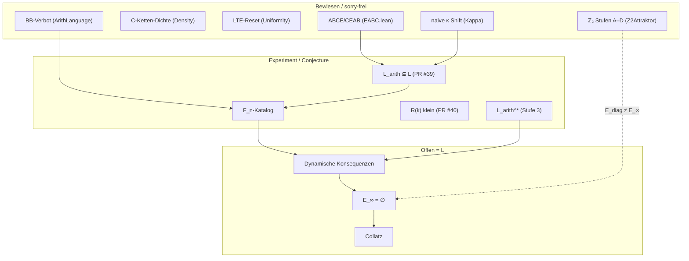

# Lücke **L** — Kartierung (Collatz-Generalangriff, Juni 2026)

**Epistemische Warnung:** Collatz ist **nicht** bewiesen. Dieses Dokument kartiert die kleinste dokumentierte Brücke **L** zwischen der sorry-freien EABC-/Lean-Struktur und der punktweisen Collatz-Vermutung.

**Methodik:** Tao-Stil — Definition / Theorem / Conjecture / offene Brücke (`collatz_formalisierung_tao_stil.md`).

**Erfolgskriterium des Generalangriffs:** *(bewiesene EABC-/Lean-Struktur)* **+ L** ⟹ Collatz (odd-to-odd: $\forall n$ ungerade $\exists K: U^K(n)=1$).

---

## 1. Exakte Aussage von **L**

### 1.1 Kanonische Formulierung (Collatz-äquivalent, Lean-präzise)

Die dokumentierte Kernbrücke aus `collatz_equivalenz_e_infty.tex` (§Forschungsauftrag) lautet:

$$\boxed{\text{endliche EABC-Grammatik} \;\Longrightarrow\; \text{Ausschluss unendlich schlechter natürlicher Realisierungen}}$$

In Lean ist das **logisch äquivalent** zur Collatz-Vermutung — nicht schwächer, sondern **umformuliert**:

```lean
-- CollatzEabc.Open (sorry-frei: nur Äquivalenz, kein Beweis)
def ExceptionSetInfinity : Set ℕ :=
  { n | Odd n ∧ ∀ K, iterateU n K ≠ 1 }

def collatzUniformityConjecture : Prop :=
  ExceptionSetInfinity = ∅

-- Äquivalent (sorry-frei bewiesen):
-- collatzUniformityConjecture ↔ (∀ n, Odd n → ∃ K, iterateU n K = 1)
```

**TeX-Äquivalent** (`collatz_equivalenz_e_infty.tex`):

> Es gibt kein $n\in\mathbb{N}_{\mathrm{odd}}$, dessen Bahnwort $w(n)\in\{E,A,B,C\}^{\mathbb{N}}$ dauerhaft außerhalb der Fixpunktklasse verbleibt (d. h. $U^K(n)\neq 1$ für alle $K$).

**Ehrliche Einordnung:** Als reine `Prop` ist **L = Collatz** (bzw. $E_\infty=\emptyset$). Der Generalangriff sucht daher **operational schwächere Zwischenlemma**, die zusammen mit der bewiesenen Struktur L implizieren — nicht eine logisch echte Verallgemeinerung von Collatz.

---

### 1.2 Operationale Zerlegung von **L** (Pipeline-Stufe 2/3)

Die Forschungsorganisation zerlegt dieselbe Lücke in **drei Schichten** (vgl. `collatz_generalangriff_2026.md`, Dependency Graph):

| Schicht | Lean-/TeX-Objekt | Status |
|---------|------------------|--------|
| **L₁ — Grammatik** | $\mathcal{L}(k)$: lokale Regeln ($BB\notin\mathcal{L}$, endliche $C$-Ketten, $C^*_{\max}\to EA$) | **Theorem** (TeX/Lean `isGrammarValid`; vollständige DFA nur Python) |
| **L₂ — Realisierbarkeit** | $\mathcal{L}_{\mathrm{arith}}(k)$: Wörter mit $\exists n$, $\kappa$-Präfix $=w$ | **Definition** Lean; **Experiment** Python; **⊊** nur beobachtet |
| **L₃ — Dynamik** | Kein $n$ realisiert ein **schlechtes unendliches** Wort in $\mathcal{L}^{\mathbb{N}}$ | **offen** (= Collatz-Kern) |

**Lean-Schnittstelle L₂:**

```lean
-- CollatzEabc.ArithLanguage
def RealizableWord (w : List EabcLetter) : Prop :=
  ∃ n : ℕ, ∃ h : Odd n, ∃ hdef : kappaPrefixDefined n w.length h,
    kappaPrefixWord n w.length h hdef = w
```

**Verbotene Muster** (Experiment, nicht Theorem):

$$F_n := \mathcal{L}(n) \setminus \mathcal{L}_{\mathrm{arith}}(n)$$

Python: `collatz_forbidden_words.py` → `collatz_forbidden_words.json`; Tests: `tests/test_forbidden_words.py`.

---

### 1.3 Kandidaten-Zwischenlemma (schwächer als Collatz, strategisch)

Aus `collatz_generalangriff_2026.md` (L₁–L₆); Rang nach Stufe-3-Priorität:

| ID | Aussage (Präzis) | vs. Collatz | Lean |
|----|------------------|-------------|------|
| **L₁** | Präperiodizität: $\forall N\,\exists k\geq N: n_k\in E_{N,N}$ ⇒ Bahn präperiodisch | schwächer (deckt Divergenz vermutlich nicht) | nicht formalisiert |
| **L₂** | $\nexists n$: $w(n)\in\mathcal{L}^{\mathbb{N}}$ und $\forall K: U^K(n)\neq 1$ | **äquivalent** zu Collatz | `RealizableWord` partiell |
| **L₃** | Beschränktheit aller odd-to-odd-Bahnen | strikt schwächer | fehlt |
| **L₄** | $\exists$ treue $\kappa$ (`FaithfulKappa`, `kappaConjecture`) | schwächer, wenn $\mathcal{E}_\infty$ charakterisiert | `Kappa.lean`, **offen** |
| **L₅** | Einziger Zyklus $\{1\}$ | strikt schwächer | projektspezifisch |
| **L₆** | $\mathrm{dist}_2(U^k(n),E_{\mathrm{diag}})\to 0$ | falsches Zielobjekt | `sorry` in Root-Lean |

**Stufe-3-Leitsatz** (Conjecture, kein Theorem): Nicht einzelne verbotene Wörter ($\mathrm{BE}$), sondern **Sprachverdünnung** $R(k)=|L_{\mathrm{arith}}\cap L|/|L|\to 0$ und kodierungsfreies $\mathcal{L}_{\mathrm{arith}}^*=\bigcap_{\kappa\in\mathcal{K}_{\mathrm{reason}}}\mathcal{L}_{\mathrm{arith}}^\kappa$.

---

### 1.4 Empfohlene Lean-`Prop` für den Generalangriff

Für die **kleinste noch nicht bewiesene Brücke** in der Pipeline (nicht logisch schwächer als Collatz, aber operational zerlegbar):

```lean
/-- L_dyn: Jeder ungerade Start, dessen gesamte Bahn nur grammatisch zulässige
    EABC-Präfixe trägt und kein verbotenes Präfix aus F_n enthält, erreicht 1.
    (Noch nicht in Lean — Vorschlag für nächste Formalisierung.) -/
def dynamicGrammarBridge : Prop :=
  ∀ n : ℕ, (h : Odd n) →
    (∀ K, kappaPrefixDefined n K h) →
    (∀ K, isGrammarValid (kappaPrefixWord n K h (by sorry))) →
    ∃ K', iterateU n K' = 1
```

**Noch offen:** Vollständige Grammatik `isGrammarValid` in Lean (nur $BB$); Verbindung $F_n\to$ Trajektorien; Kodierungsfreiheit ($\mathcal{L}_{\mathrm{arith}}^*$).

**Minimal plausible L** im Sinne des Generalangriffs (TeX, `collatz_generalangriff_2026.md` Zeilen 26–30):

> Schließe die Lücke *endliche EABC-Grammatik ⇒ Ausschluss unendlich schlechter natürlicher Realisierungen* — d. h. zeige, dass **lokal zulässige** EABC-Wörter nicht **global für jedes** $n\in\mathbb{N}_{\mathrm{odd}}$ eine nicht-konvergierende Bahn realisieren.

---

## 2. Was ist bewiesen / formalisiert vs. nur dokumentiert?

### 2.1 Lean — sorry-frei (`collatz_eabc_core`, 0 `sorry` in `CollatzEabc/`)

| Modul | Inhalt | Collatz-Relevanz |
|-------|--------|------------------|
| `EABC.lean` (Root) | mod-12-Klassifikation, $T^4=\mathrm{id}$, Chiralität | Struktur, **nicht** Collatz |
| `CollatzEabc.Density` | C-Ketten-Dichte, Tail $(1-p)^n\to 0$ | fast-sicher, **nicht** punktweise |
| `CollatzEabc.Uniformity` | LTE-Reset, `lteWorst`, Valuation | Widerlegt naive Uniformität |
| `CollatzEabc.Z2Attraktor` | Stufen A–D: Metrik, `ExceptionSetApprox`, Monotonie, $U$-Invarianz | $E_{\mathrm{diag}}$, **nicht** $E_\infty$ |
| `CollatzEabc.Open` | `ExceptionSetInfinity`, `collatzUniformityConjecture`, Äquivalenzen | **Prop-Grenze** Collatz |
| `CollatzEabc.Kappa` | `kappaPrefix`, `kappaPrefix_get_shift`, `FaithfulKappa`, `kappaConjecture` | naive $\kappa$ dynamiktreu; treue $\kappa$ **offen** |
| `CollatzEabc.ArithLanguage` | `isGrammarValid` ($BB$), `RealizableWord` | L₂-Schnittstelle |
| `CollatzEabc.PrefProjection` | $\Phi_{\mathrm{pref}}$ auf Wörtern | keine Dynamikbrücke |
| `CollatzEabc.BernoulliClock` | Zell-Tripel, Bernoulli-Uhr | **kein** Collatz-Beweis (parallel PR #51) |
| `CollatzEabc.Mod12Matrix` | mod-12-Matrix | kombinatorisch |

### 2.2 Lean — mit `sorry` (Forschungsversuche, nicht CI-Kern)

| Datei | `sorry`-Stellen | Bedeutung |
|-------|-----------------|-----------|
| `collatz_z2_attraktor.lean` | Stufe E: `collatz_uniformity_conjecture` + Strategien 1–5 | dokumentierte No-Go-Pfade |
| `collatz_uniformity_e.lean` | Kontraktion, Mischbrücke | Beweisversuche |
| `collatz_mod12_matrix.lean` | 1× | Irreduzibilität offen |

**Kein `axiom` für Collatz** im EABC-Kern — nur offene `Prop` und kommentierte `sorry` in Root-Forschungsdateien.

### 2.3 Python — Experiment / Negativtests (kein Beweis)

| Artefakt | Rolle | Tao-Ebene |
|----------|-------|-----------|
| `collatz_kappa_test.py` | naive $\kappa$: dynamiktreu, nicht injektiv | Experiment |
| `collatz_l_arith_test.py` | $L(k)$ vs. $L_{\mathrm{arith}}(k)$, Ratios | Experiment |
| `collatz_forbidden_words.py` | $F_n$-Katalog, $\mathrm{BE}$ Hero | Zeuge / Experiment |
| `collatz_kappa_robustheit.py` | $\kappa_1,\kappa_2,\kappa_3$; BE κ-abhängig | Negativtest (PR #40) |
| `tests/test_forbidden_words.py` | $F_2\ni\mathrm{BE}$ | Regression |
| `tests/test_kappa_robustheit.py` | $\kappa_2$ realisiert BE | Regression |

### 2.4 Nur TeX / Conjecture (nicht Lean-Theorem)

- Lemma E (Präperiodizität) — `collatz_equivalenz_e_infty.tex` Zeilen 204–211
- $R(k)\to 0$, $h_F\approx 1{,}19$ — Stufe 2B/3
- EABC-Bernoulli/Zeta-Sensor (PR #51) — **parallel**, kein Collatz-Beweis
- Morley-Sensorik — geometrischer Nebenzweig

---

## 3. Kleinste blockierende Zwischenlemma (gerankt)

| Rang | Lemma | `Prop`-Skizze | Blockiert | Lean |
|------|-------|---------------|-----------|------|
| **1** | **Dynamikbrücke** $F_n / \mathcal{L}_{\mathrm{arith}}^* \to E_\infty=\emptyset$ | Verbotene/universell-realisable Wörter erzwingen Konvergenz | **L₃**, Collatz | fehlt |
| **2** | **Kodierungsfreie** $\mathcal{L}_{\mathrm{arith}}^*$ | $\mathcal{L}_{\mathrm{arith}}^* := \bigcap_{\kappa\in\mathcal{K}}\mathcal{L}_{\mathrm{arith}}^\kappa\neq\emptyset$, nicht trivial | L₂ ohne κ-Artefakt | Definition offen |
| **3** | **Vollständige Grammatik** in Lean | $C$-Kapazität, $C^*_{\max}\to EA$ als `isGrammarValid` | $F_n$ formal | nur $BB$ in Lean |
| **4** | **Treue $\kappa$** | `kappaConjecture` / `faithfulKappaExists K` | Injektive Bahnkodierung | offen (`Kappa.lean`) |
| **5** | **Theorem** $\mathcal{L}_{\mathrm{arith}}\subsetneq\mathcal{L}$ | $\forall k$: $|L_{\mathrm{arith}}(k)|<|L(k)|$ oder $\mathrm{BE}\notin\mathcal{L}_{\mathrm{arith}}$ universal | Experiment → Theorem | nur Experiment |
| **6** | **$R(k)\to 0$** | asymptotische Dünnheit | heuristische Brücke zu L₃ | Conjecture |
| **7** | **Lemma E** | Präperiodizität aus $E_{N,N}$-Besuch | Zyklus/Divergenz-Trennung | TeX-Skizze |
| **8** | **Punktweise Ergodik** | Kingman/Birkhoff für Collatz | Uniformitätsstrategie | Mathlib-Lücke |

**κ-Status (Stufe 1):**

| Eigenschaft | naive `kappaPrefix` | `FaithfulKappa` |
|-------------|---------------------|-----------------|
| dynamiktreu | **ja** (`kappaPrefix_get_shift`) | gefordert |
| injektiv | **nein** (Kollisionen) | gefordert |
| vollständig ($\bot$-frei) | **nein** ($n\equiv 3,9\pmod{12}$) | offen |

---

## 4. Abhängigkeitsgraph (bewiesen → L → Collatz)



---

## 5. `sorry` / `axiom` / `Prop`-Grenzen

| Grenze | Ort | Lesart |
|--------|-----|--------|
| Collatz ≡ $E_\infty=\emptyset$ | `Open.collatz_iff_exceptionSetInfinity_empty` | **bewiesene Äquivalenz**, nicht Collatz |
| Collatz selbst | `collatzUniformityConjecture` | **offene `Prop`**, kein Beweis |
| $E_{\mathrm{diag}}\neq E_\infty$ | TeX + Kommentar `Z2Attraktor` | $n=27$ Gegenbeispiel |
| Stufe E Versuche | `collatz_z2_attraktor.lean` ab Z. 464 | `sorry` = dokumentierte Sackgassen |
| Treue κ | `kappaConjecture` | offene `Prop`, kein `sorry` im Kern |
| Bernoulli-Sensor | `BernoulliClock.lean` | definitorisch, **nicht** L |

**Paradox (dokumentiert):** `grep sorry CollatzEabc/` ist leer, aber Collatz bleibt offen — die Vermutung lebt als **benannte `Prop`**, nicht als Beweis.

---

## 6. Tao-Einordnung (fünf Ebenen)

| Ebene | L-Bezug | Stand |
|-------|---------|-------|
| Definition | $E_\infty$, $\mathcal{L}$, $\mathcal{L}_{\mathrm{arith}}$, $F_n$, $\kappa$ | formalisiert |
| Zeuge | $\mathrm{BE}\in F_2$ ($\kappa_1$); $\kappa_2$ realisiert BE | Beobachtung |
| Experiment | $R(10)\approx 0{,}87\,\%$; $|F_n|$-Wachstum | reproduzierbar |
| Theorem | lokale Grammatik, ABCE, LTE-No-Go, naive κ-Shift | sorry-frei |
| Conjecture | **L** / $E_\infty=\emptyset$, $R(k)\to 0$, Lemma E | **offen** |

---

## 7. Referenzen

| Artefakt | Rolle |
|----------|-------|
| `collatz_generalangriff_2026.md` | Forschungsreport, L₁–L₆ |
| `collatz_offene_punkte.md` | Synthese offener Punkte |
| `collatz_formalisierung_tao_stil.md` | Methodik |
| `collatz_stufe2b_kappa_robustheit.md` | PR #40 |
| `collatz_stufe3_kappa_invarianz.md` | Stufe 3 |
| `collatz_equivalenz_e_infty.tex` | Lemma E, $E_\infty$ |
| `collatz_eabc_core/CollatzEabc/Open.lean` | `ExceptionSetInfinity` |
| `collatz_eabc_core/CollatzEabc/Kappa.lean` | κ-Schnittstelle |
| `collatz_eabc_core/CollatzEabc/ArithLanguage.lean` | `RealizableWord` |

---

## 8. Kurzfassung

1. **L** in logischer Härte = **`ExceptionSetInfinity = ∅`** (Collatz); Lean benennt das als `collatzUniformityConjecture` ohne Beweis.
2. **Operational** zerlegt sich L in **Grammatik** (bewiesen lokal) → **Realisierbarkeit** ($\mathcal{L}_{\mathrm{arith}}\subsetneq\mathcal{L}$, experimentell) → **Dynamik** (fehlt).
3. **Kleinster Blocker:** Brücke *verbotene Muster / $\mathcal{L}_{\mathrm{arith}}^*$ → keine unendlich schlechten natürlichen Realisierungen* — weder in Lean noch in TeX bewiesen.
4. **Nicht Collatz:** EABC-Struktur, Dichte, Mischung, $F_n$-Katalog, Bernoulli-Sensor (PR #51).

*Stand: Juni 2026 — Branch `collatz/luecke-L-kartierung`.*
